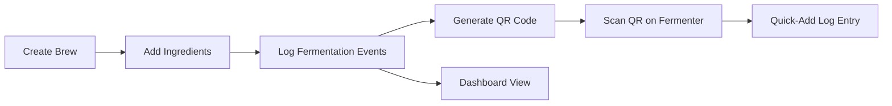
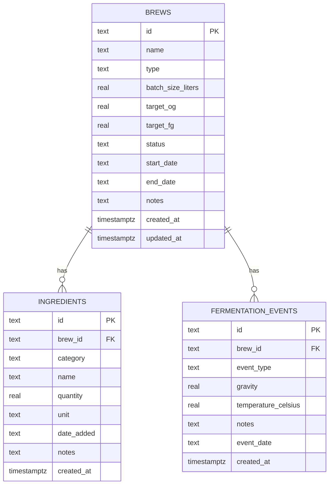
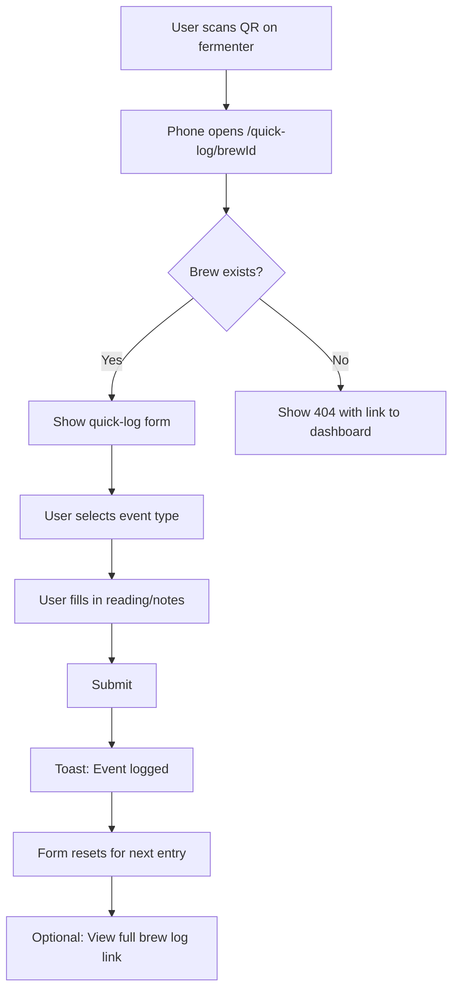
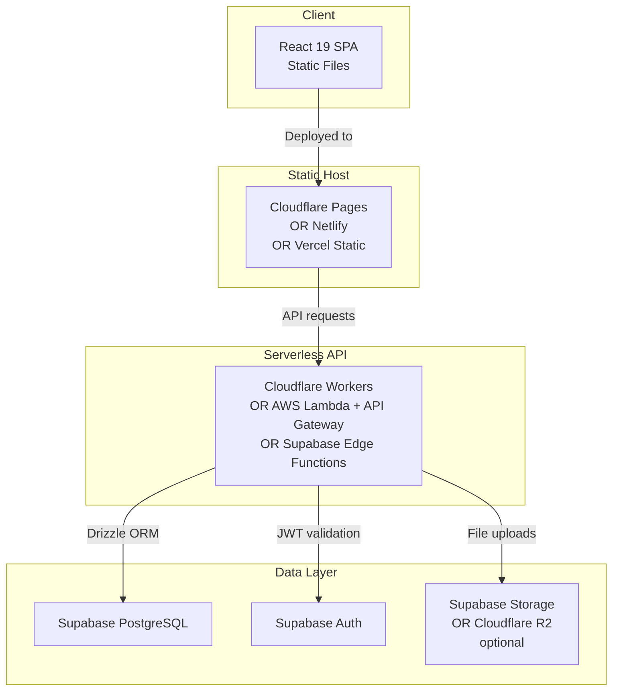

# BrewLog — Architecture Document

> A personal homebrew tracking web app for beer, mead, and cider.

---

## Table of Contents

1. [Overview](#overview)
2. [Tech Stack](#tech-stack)
3. [Database Schema](#database-schema)
4. [Route / Page Structure](#route--page-structure)
5. [Component Architecture](#component-architecture)
6. [API Layer](#api-layer)
7. [QR Code Flow](#qr-code-flow)
8. [Project File / Folder Structure](#project-file--folder-structure)
9. [Deployment Architecture](#deployment-architecture)
10. [Key npm Dependencies](#key-npm-dependencies)
11. [Architectural Decisions & Trade-offs](#architectural-decisions--trade-offs)

---

## Overview

BrewLog is a single-user web application for tracking homebrew batches of beer, mead, and cider. Users create brews, log ingredients, record fermentation events over time, and generate QR codes to attach to fermenters for quick mobile access.

All measurements use the **metric system** — liters for volume, grams/kilograms for weight, and Celsius for temperature.

### Core Workflow



---

## Tech Stack

| Layer | Technology | Rationale |
|-------|-----------|-----------|
| Frontend | React 19 SPA (Vite) | Fast builds, modern React features, static deployment |
| Language | TypeScript | Type safety across frontend and API |
| Routing | React Router v7 | Client-side routing for SPA |
| Server State | TanStack Query (React Query) | Caching, background refetching, optimistic updates |
| Local State | Zustand | Lightweight, minimal boilerplate |
| Styling | Tailwind CSS + shadcn/ui | Rapid UI development with accessible components |
| Backend API | Cloudflare Workers / AWS Lambda / Supabase Edge Functions | Serverless, free-tier friendly |
| Database | Supabase PostgreSQL | Managed PostgreSQL with generous free tier |
| ORM | Drizzle ORM (with serverless adapter) | Type-safe, lightweight, serverless-compatible |
| Auth | Supabase Auth | Free tier, built-in with Supabase |
| QR Codes | `qrcode.react` | Client-side QR generation as React component |

---

## Database Schema

### Entity Relationship Diagram



### Table Definitions

#### `brews`

| Column | Type | Constraints | Description |
|--------|------|-------------|-------------|
| `id` | `text` | PK, nanoid | Unique brew identifier |
| `name` | `text` | NOT NULL | Brew name |
| `type` | `text` | NOT NULL | `beer`, `mead`, or `cider` |
| `batch_size_liters` | `real` | NOT NULL | Batch size in liters |
| `target_og` | `real` | | Target original gravity |
| `target_fg` | `real` | | Target final gravity |
| `status` | `text` | NOT NULL, DEFAULT `fermenting` | One of: `planning`, `fermenting`, `conditioning`, `bottled`, `done` |
| `start_date` | `text` | NOT NULL | ISO 8601 date |
| `end_date` | `text` | | ISO 8601 date, nullable |
| `notes` | `text` | | Free-form notes |
| `created_at` | `timestamptz` | NOT NULL, DEFAULT now() | ISO 8601 timestamp |
| `updated_at` | `timestamptz` | NOT NULL, DEFAULT now() | ISO 8601 timestamp |

#### `ingredients`

| Column | Type | Constraints | Description |
|--------|------|-------------|-------------|
| `id` | `text` | PK, nanoid | Unique ingredient identifier |
| `brew_id` | `text` | FK → brews.id, NOT NULL | Parent brew |
| `category` | `text` | NOT NULL | `grain`, `hop`, `honey`, `fruit`, `yeast`, `adjunct`, `other` |
| `name` | `text` | NOT NULL | Ingredient name |
| `quantity` | `real` | NOT NULL | Amount |
| `unit` | `text` | NOT NULL | `g`, `kg`, `ml`, `L`, `tsp`, `tbsp`, `pkg`, `each` |
| `date_added` | `text` | | ISO 8601 date — when added to the brew |
| `notes` | `text` | | e.g. boil time, dry hop duration |
| `created_at` | `timestamptz` | NOT NULL, DEFAULT now() | ISO 8601 timestamp |

#### `fermentation_events`

| Column | Type | Constraints | Description |
|--------|------|-------------|-------------|
| `id` | `text` | PK, nanoid | Unique event identifier |
| `brew_id` | `text` | FK → brews.id, NOT NULL | Parent brew |
| `event_type` | `text` | NOT NULL | `gravity_reading`, `temperature`, `racking`, `addition`, `tasting`, `note`, `bottling`, `other` |
| `gravity` | `real` | | Specific gravity reading |
| `temperature_celsius` | `real` | | Temperature in °C |
| `notes` | `text` | | Free-form notes |
| `event_date` | `text` | NOT NULL | ISO 8601 datetime |
| `created_at` | `timestamptz` | NOT NULL, DEFAULT now() | ISO 8601 timestamp |

### Drizzle Schema Notes

- All IDs use `nanoid` — short, URL-safe, collision-resistant.
- Timestamps use PostgreSQL `timestamptz` for native timezone-aware date handling.
- Foreign keys enforced via Drizzle relations and PostgreSQL constraints.
- Indexes on `ingredients.brew_id` and `fermentation_events.brew_id` for query performance.
- Drizzle ORM is used with the `drizzle-orm/postgres-js` adapter for serverless compatibility.

---

## Route / Page Structure

Routes are defined using React Router v7 in the client-side SPA:

```
src/routes/
├── root.tsx                      # Root layout with nav, theme provider
├── dashboard.tsx                 # Dashboard — all brews overview
├── brews/
│   ├── new.tsx                   # Create new brew form
│   └── $brewId/
│       ├── layout.tsx            # Brew detail layout with tabs
│       ├── index.tsx             # Brew overview/summary
│       ├── ingredients.tsx       # Ingredients list + add form
│       ├── log.tsx               # Fermentation event timeline + add form
│       ├── qr.tsx                # QR code display + download
│       └── edit.tsx              # Edit brew details
├── quick-log/
│   └── $brewId.tsx               # Mobile-optimized quick-add entry (QR target)
└── not-found.tsx                 # 404 page
```

### Route Summary

| Route | Purpose | Key Features |
|-------|---------|-------------|
| `/` | Dashboard | Brew cards grouped by status, search/filter |
| `/brews/new` | Create brew | Form with type selector, batch params (liters) |
| `/brews/:brewId` | Brew summary | Overview stats, latest readings, ABV calc |
| `/brews/:brewId/ingredients` | Ingredients | Table of ingredients, add/edit/delete |
| `/brews/:brewId/log` | Fermentation log | Timeline of events, add new entries |
| `/brews/:brewId/qr` | QR code | Generate, display, download QR |
| `/brews/:brewId/edit` | Edit brew | Update brew metadata and status |
| `/quick-log/:brewId` | Quick-add entry | Mobile-first form reached via QR scan |

---

## Component Architecture

### Layout Components

| Component | File | Responsibility |
|-----------|------|---------------|
| `RootLayout` | `src/layouts/root-layout.tsx` | HTML shell, font loading, theme provider |
| `AppNav` | `src/components/app-nav.tsx` | Top navigation bar with logo and links |
| `BrewDetailLayout` | `src/layouts/brew-detail-layout.tsx` | Tab navigation between brew sub-pages |

### Dashboard Components

| Component | File | Responsibility |
|-----------|------|---------------|
| `BrewDashboard` | `src/components/brew-dashboard.tsx` | Fetches and displays all brews via TanStack Query |
| `BrewCard` | `src/components/brew-card.tsx` | Single brew summary card with status badge |
| `StatusFilter` | `src/components/status-filter.tsx` | Filter brews by status |
| `BrewTypeIcon` | `src/components/brew-type-icon.tsx` | Icon for beer/mead/cider |

### Brew Detail Components

| Component | File | Responsibility |
|-----------|------|---------------|
| `BrewSummary` | `src/components/brew-summary.tsx` | Overview stats: OG, FG, ABV, batch size (L), age |
| `GravityChart` | `src/components/gravity-chart.tsx` | Line chart of gravity readings over time |
| `BrewStatusBadge` | `src/components/brew-status-badge.tsx` | Colored badge for brew status |

### Form Components

| Component | File | Responsibility |
|-----------|------|---------------|
| `BrewForm` | `src/components/forms/brew-form.tsx` | Create/edit brew form |
| `IngredientForm` | `src/components/forms/ingredient-form.tsx` | Add/edit ingredient (metric units) |
| `EventForm` | `src/components/forms/event-form.tsx` | Add fermentation event (°C) |
| `QuickLogForm` | `src/components/forms/quick-log-form.tsx` | Simplified mobile event form |

### Ingredient Components

| Component | File | Responsibility |
|-----------|------|---------------|
| `IngredientTable` | `src/components/ingredient-table.tsx` | Table of all ingredients for a brew |
| `IngredientRow` | `src/components/ingredient-row.tsx` | Single ingredient with edit/delete |

### Fermentation Log Components

| Component | File | Responsibility |
|-----------|------|---------------|
| `EventTimeline` | `src/components/event-timeline.tsx` | Chronological list of events |
| `EventCard` | `src/components/event-card.tsx` | Single event display |
| `EventTypeIcon` | `src/components/event-type-icon.tsx` | Icon per event type |

### QR Components

| Component | File | Responsibility |
|-----------|------|---------------|
| `QrCodeDisplay` | `src/components/qr-code-display.tsx` | Renders QR code using `qrcode.react` |
| `QrDownloadButton` | `src/components/qr-download-button.tsx` | Download QR as PNG |
| `QrPrintButton` | `src/components/qr-print-button.tsx` | Print-friendly QR with brew name |

### Shared / UI Components

All shadcn/ui primitives live in `src/components/ui/` — Button, Card, Input, Select, Badge, Dialog, Table, Tabs, Toast, etc.

---

## API Layer

The backend is a serverless API deployed to one of the supported free-tier providers. It exposes RESTful endpoints consumed by the React frontend via TanStack Query.

### API Endpoints

#### Brews — `/api/brews`

| Method | Endpoint | Description |
|--------|----------|-------------|
| `GET` | `/api/brews` | List all brews, ordered by updated_at desc |
| `GET` | `/api/brews/:brewId` | Get single brew with ingredient + event counts |
| `POST` | `/api/brews` | Create a new brew |
| `PUT` | `/api/brews/:brewId` | Update brew metadata |
| `PATCH` | `/api/brews/:brewId/status` | Change brew status |
| `DELETE` | `/api/brews/:brewId` | Delete brew and cascade ingredients/events |

#### Ingredients — `/api/brews/:brewId/ingredients`

| Method | Endpoint | Description |
|--------|----------|-------------|
| `GET` | `/api/brews/:brewId/ingredients` | List all ingredients for a brew |
| `POST` | `/api/brews/:brewId/ingredients` | Add ingredient to brew |
| `PUT` | `/api/brews/:brewId/ingredients/:id` | Edit ingredient |
| `DELETE` | `/api/brews/:brewId/ingredients/:id` | Remove ingredient |

#### Fermentation Events — `/api/brews/:brewId/events`

| Method | Endpoint | Description |
|--------|----------|-------------|
| `GET` | `/api/brews/:brewId/events` | List all events for a brew, ordered by event_date |
| `POST` | `/api/brews/:brewId/events` | Log a fermentation event |
| `DELETE` | `/api/brews/:brewId/events/:id` | Remove an event |

### Validation

All request bodies are validated using Zod schemas on the serverless API before database operations. The same Zod schemas can be shared between frontend and backend via a shared package or copy.

### Authentication

API endpoints are protected by Supabase Auth. The frontend obtains a JWT from Supabase Auth and sends it as a `Bearer` token in the `Authorization` header. The serverless API validates the JWT against Supabase's JWKS endpoint.

---

## QR Code Flow

### Generation

1. When a brew is created, a unique `id` is assigned via `nanoid`.
2. On the `/brews/:brewId/qr` page, the QR code is generated **client-side** using the `qrcode.react` library.
3. The QR encodes the URL: `{APP_BASE_URL}/quick-log/{brewId}`
4. `APP_BASE_URL` is set via the `VITE_APP_URL` environment variable — defaults to `http://localhost:5173` in development.

### URL Format

```
https://your-domain.com/quick-log/abc123nanoid
```

### QR Display Page Features

- Large QR code image rendered as SVG via `qrcode.react`
- Brew name and type displayed above the QR
- **Download as PNG** button — saves a print-ready image
- **Print** button — opens print dialog with a label layout including brew name, type, start date, and QR code

### Scanning Experience



### Quick-Log Page Design

The `/quick-log/:brewId` page is optimized for mobile:

- **Header**: Brew name and current status
- **Event type selector**: Large tap targets — Gravity, Temperature, Tasting, Racking, Addition, Note
- **Dynamic fields**: Based on selected type
  - Gravity → gravity input with numeric keyboard
  - Temperature → temp input in °C
  - Tasting → notes textarea
  - Racking → notes textarea
  - Addition → name + quantity (g/kg/ml/L) + notes
  - Note → notes textarea
- **Date/time**: Defaults to now, editable
- **Submit button**: Large, prominent
- **Success state**: Toast notification, form resets, link to full log

---

## Project File / Folder Structure

```
brewlog/
├── frontend/                       # React 19 SPA (Vite)
│   ├── src/
│   │   ├── main.tsx                # App entry point
│   │   ├── App.tsx                 # Router setup
│   │   ├── index.css               # Global styles (Tailwind)
│   │   ├── routes/                 # Route components (React Router v7)
│   │   │   ├── root.tsx
│   │   │   ├── dashboard.tsx
│   │   │   ├── brews/
│   │   │   │   ├── new.tsx
│   │   │   │   └── $brewId/
│   │   │   │       ├── layout.tsx
│   │   │   │       ├── index.tsx
│   │   │   │       ├── ingredients.tsx
│   │   │   │       ├── log.tsx
│   │   │   │       ├── qr.tsx
│   │   │   │       └── edit.tsx
│   │   │   ├── quick-log/
│   │   │   │   └── $brewId.tsx
│   │   │   └── not-found.tsx
│   │   ├── components/
│   │   │   ├── ui/                 # shadcn/ui primitives
│   │   │   ├── forms/
│   │   │   │   ├── brew-form.tsx
│   │   │   │   ├── ingredient-form.tsx
│   │   │   │   ├── event-form.tsx
│   │   │   │   └── quick-log-form.tsx
│   │   │   ├── app-nav.tsx
│   │   │   ├── brew-card.tsx
│   │   │   ├── brew-dashboard.tsx
│   │   │   ├── brew-status-badge.tsx
│   │   │   ├── brew-summary.tsx
│   │   │   ├── brew-type-icon.tsx
│   │   │   ├── event-card.tsx
│   │   │   ├── event-timeline.tsx
│   │   │   ├── event-type-icon.tsx
│   │   │   ├── gravity-chart.tsx
│   │   │   ├── ingredient-row.tsx
│   │   │   ├── ingredient-table.tsx
│   │   │   ├── qr-code-display.tsx
│   │   │   ├── qr-download-button.tsx
│   │   │   ├── qr-print-button.tsx
│   │   │   └── status-filter.tsx
│   │   ├── layouts/
│   │   │   ├── root-layout.tsx
│   │   │   └── brew-detail-layout.tsx
│   │   ├── lib/
│   │   │   ├── api-client.ts       # Fetch wrapper for API calls
│   │   │   ├── queries.ts          # TanStack Query hooks
│   │   │   ├── mutations.ts        # TanStack Query mutation hooks
│   │   │   ├── store.ts            # Zustand store(s)
│   │   │   ├── utils.ts            # Shared utilities (ABV calc, date formatting)
│   │   │   ├── types.ts            # Shared TypeScript types/enums
│   │   │   └── validators.ts       # Zod schemas for form validation
│   │   └── assets/                 # Static assets (icons, images)
│   ├── public/
│   │   └── icons/                  # App icons, favicon
│   ├── .env                        # VITE_APP_URL, VITE_API_URL, VITE_SUPABASE_URL, VITE_SUPABASE_ANON_KEY
│   ├── vite.config.ts              # Vite configuration
│   ├── tailwind.config.ts          # Tailwind configuration
│   ├── tsconfig.json
│   └── package.json
│
├── api/                            # Serverless API (Cloudflare Workers / AWS Lambda / Supabase Edge Functions)
│   ├── src/
│   │   ├── index.ts                # Entry point / router
│   │   ├── routes/
│   │   │   ├── brews.ts            # Brew CRUD handlers
│   │   │   ├── ingredients.ts      # Ingredient CRUD handlers
│   │   │   └── events.ts           # Event CRUD handlers
│   │   ├── db/
│   │   │   ├── index.ts            # Drizzle client + PostgreSQL connection
│   │   │   ├── schema.ts           # Drizzle table definitions
│   │   │   └── migrations/         # Generated migration files
│   │   ├── middleware/
│   │   │   └── auth.ts             # Supabase JWT validation middleware
│   │   ├── validators.ts           # Zod schemas for request validation
│   │   └── types.ts                # Shared TypeScript types
│   ├── wrangler.toml               # Cloudflare Workers config (if using CF Workers)
│   ├── tsconfig.json
│   └── package.json
│
├── ARCHITECTURE.md                 # This document
└── README.md
```

---

## Deployment Architecture

The application is split into three independently deployed tiers, all using free-tier services:



### Free-Tier Provider Options

| Tier | Provider | Free Tier Limits |
|------|----------|-----------------|
| **Static Frontend** | Cloudflare Pages | Unlimited requests, 500 builds/month |
| | Netlify | 100 GB bandwidth/month, 300 build minutes/month |
| | Vercel (static) | 100 GB bandwidth/month |
| **Serverless API** | Cloudflare Workers | 100,000 requests/day, 10 ms CPU time |
| | AWS Lambda + API Gateway | 1M requests/month, 400,000 GB-seconds compute |
| | Supabase Edge Functions | 500,000 invocations/month, 50 MB script size |
| **Database** | Supabase PostgreSQL | 500 MB storage, 2 GB bandwidth/month |
| | Neon PostgreSQL | 512 MB storage, 190 compute hours/month |
| | PlanetScale (MySQL) | 1 GB storage, 1B row reads/month |
| | Turso (libSQL) | 9 GB storage, 500M row reads/month |
| **Auth** | Supabase Auth | 50,000 monthly active users |
| | Clerk | 10,000 monthly active users |
| **File Storage** | Supabase Storage | 1 GB storage, 2 GB bandwidth/month |
| | Cloudflare R2 | 10 GB storage, 10M reads/month |

### Environment Variables

**Frontend** (`.env`):
```
VITE_APP_URL=https://brewlog.pages.dev
VITE_API_URL=https://api.brewlog.workers.dev
VITE_SUPABASE_URL=https://xxxxx.supabase.co
VITE_SUPABASE_ANON_KEY=eyJ...
```

**API** (environment/secrets):
```
DATABASE_URL=postgresql://...
SUPABASE_JWT_SECRET=...
SUPABASE_URL=https://xxxxx.supabase.co
```

---

## Key npm Dependencies

### Frontend — Production

| Package | Purpose |
|---------|---------|
| `react` / `react-dom` | React 19 UI library |
| `react-router` | Client-side routing (v7) |
| `@tanstack/react-query` | Server state management, caching, mutations |
| `zustand` | Lightweight local state management |
| `qrcode.react` | Client-side QR code generation as React component |
| `zod` | Schema validation for forms |
| `date-fns` | Date formatting and manipulation |
| `recharts` | Charting library for gravity/temperature graphs |
| `lucide-react` | Icon library — used by shadcn/ui |
| `class-variance-authority` | Component variant styling — shadcn/ui dependency |
| `clsx` / `tailwind-merge` | Conditional class name utilities |
| `@supabase/supabase-js` | Supabase client for auth |

### Frontend — Development

| Package | Purpose |
|---------|---------|
| `vite` | Build tool and dev server |
| `@vitejs/plugin-react` | React support for Vite |
| `typescript` | Type checking |
| `tailwindcss` / `postcss` / `autoprefixer` | CSS toolchain |
| `eslint` | Linting |

### API — Production

| Package | Purpose |
|---------|---------|
| `drizzle-orm` | Type-safe ORM for PostgreSQL |
| `postgres` | PostgreSQL driver (serverless-compatible) |
| `nanoid` | Short unique ID generation |
| `zod` | Request body validation |
| `jose` | JWT validation for Supabase Auth tokens |

### API — Development

| Package | Purpose |
|---------|---------|
| `typescript` | Type checking |
| `drizzle-kit` | Migration generation and DB studio |
| `wrangler` | Cloudflare Workers local dev (if using CF Workers) |

---

## Architectural Decisions & Trade-offs

### 1. React 19 SPA + Serverless API Over Next.js

**Decision**: Use a React 19 SPA (Vite) with a separate serverless API instead of a Next.js monolith.

**Rationale**: Decoupling frontend and backend allows independent deployment, scaling, and technology choices. The static frontend can be hosted for free on any CDN. The serverless API scales to zero and stays within free tiers. No vendor lock-in to a specific framework's deployment model.

**Trade-off**: No server-side rendering — the app is fully client-rendered. Acceptable for a personal tool where SEO is irrelevant. Requires managing CORS between frontend and API.

### 2. Supabase PostgreSQL Over SQLite

**Decision**: Use Supabase PostgreSQL instead of SQLite.

**Rationale**: A serverless API cannot use SQLite (no persistent filesystem). Supabase provides a managed PostgreSQL instance with a generous free tier (500 MB), built-in auth, and real-time capabilities if needed later. Drizzle ORM abstracts the dialect, so the schema remains clean.

**Trade-off**: Requires network access to the database. Slightly higher latency than local SQLite, but negligible for a personal app.

### 3. Metric Units Only

**Decision**: All measurements use metric units exclusively — liters, grams, kilograms, Celsius.

**Rationale**: Metric is the international standard and simplifies the data model by eliminating unit conversion logic and dual-unit storage. No `temperature_unit` column needed; temperature is always Celsius. No `lb`/`oz` in the unit enum.

**Trade-off**: Users accustomed to imperial units (gallons, pounds, Fahrenheit) will need to convert. A client-side display toggle could be added later without changing the database schema.

### 4. TanStack Query for Server State

**Decision**: Use TanStack Query (React Query) for all API data fetching and mutations.

**Rationale**: Provides caching, background refetching, optimistic updates, and request deduplication out of the box. Eliminates the need for manual loading/error state management. Pairs well with a REST API.

**Trade-off**: Adds a dependency. The alternative — raw `fetch` with `useEffect` — would require significantly more boilerplate for the same functionality.

### 5. nanoid for IDs Instead of Auto-Increment

**Decision**: Use `nanoid` — 21-character URL-safe strings — for all primary keys.

**Rationale**: URL-safe without encoding, no sequential enumeration, safe for use in QR code URLs, and avoids integer overflow concerns. Generated client-side or server-side without DB coordination.

**Trade-off**: Slightly larger storage than integers. No natural ordering — use `created_at` for ordering instead.

### 6. Client-Side QR Generation

**Decision**: Generate QR codes in the browser using `qrcode.react` rather than on the server.

**Rationale**: No need to store QR images. The QR is deterministic — same URL always produces the same QR. Client-side generation avoids server load and storage. The `qrcode.react` library renders QR codes as React components (SVG or Canvas), making download/print workflows straightforward.

**Trade-off**: Requires JavaScript. Acceptable since QR display is not a critical path.

### 7. Recharts for Gravity Visualization

**Decision**: Use Recharts for the gravity-over-time chart.

**Rationale**: React-native charting library, good TypeScript support, responsive, and handles line charts well. Lighter than D3 for this use case.

**Trade-off**: Adds bundle size. Can be lazy-loaded with `React.lazy()` and only loaded on the brew detail page.

### 8. Zod for Validation

**Decision**: Use Zod schemas for both client-side form validation and server-side request validation.

**Rationale**: Single source of truth for validation rules. Integrates well with React Hook Form if needed later. The API must validate input regardless of client-side checks.

### 9. Mobile-First Quick-Log

**Decision**: The `/quick-log/:brewId` route is a separate, mobile-optimized page rather than a modal or the same page as the full log.

**Rationale**: QR scanning happens on a phone. The quick-log page needs large tap targets, minimal scrolling, and fast load times. Keeping it separate allows optimizing the layout and bundle independently.

---

## Future Considerations

These are explicitly out of scope for v1 but worth noting:

- **Recipe templates**: Save and reuse ingredient lists
- **Batch cloning**: Duplicate a brew as a starting point
- **Photo attachments**: Add photos to events (use Supabase Storage or Cloudflare R2)
- **Export**: Export brew data as JSON or CSV
- **Multi-user / sharing**: Leverage Supabase Auth for multi-user, share read-only brew pages
- **PWA support**: Offline access and home screen install for mobile
- **Notifications**: Reminders for gravity checks or dry hop schedules
- **Imperial unit display toggle**: Client-side conversion from metric storage for users who prefer imperial
- **tRPC migration**: Replace REST with tRPC for end-to-end type safety between frontend and API
