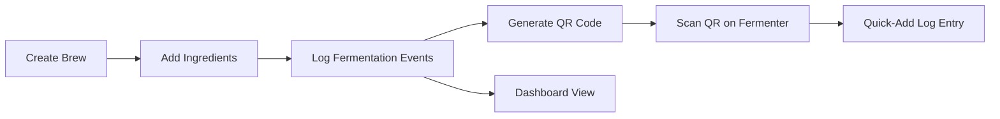
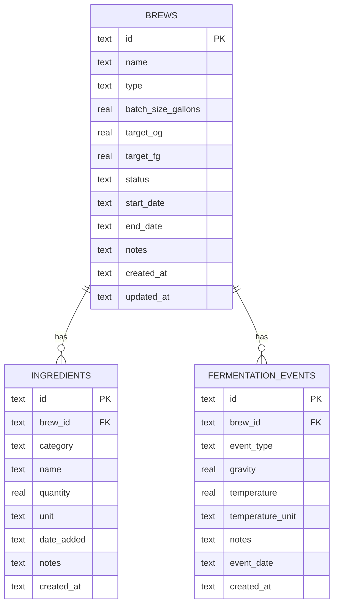
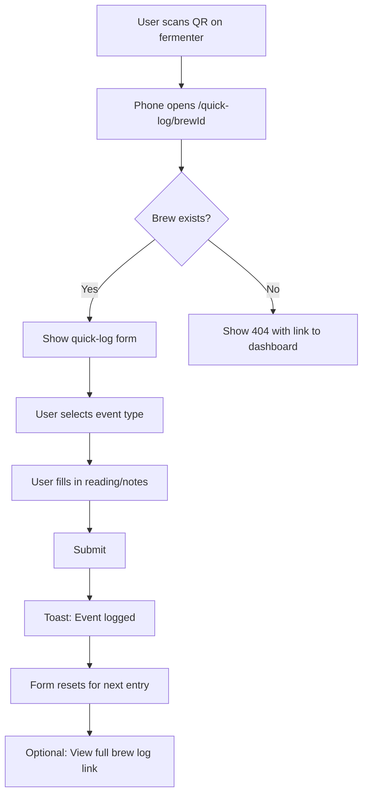

# BrewLog — Architecture Document

> A personal homebrew tracking web app for beer, mead, and cider.

---

## Table of Contents

1. [Overview](#overview)
2. [Tech Stack](#tech-stack)
3. [Database Schema](#database-schema)
4. [Route / Page Structure](#route--page-structure)
5. [Component Architecture](#component-architecture)
6. [Server Actions](#server-actions)
7. [QR Code Flow](#qr-code-flow)
8. [Project File / Folder Structure](#project-file--folder-structure)
9. [Key npm Dependencies](#key-npm-dependencies)
10. [Architectural Decisions & Trade-offs](#architectural-decisions--trade-offs)

---

## Overview

BrewLog is a single-user, local-first web application for tracking homebrew batches of beer, mead, and cider. Users create brews, log ingredients, record fermentation events over time, and generate QR codes to attach to fermenters for quick mobile access.

### Core Workflow



---

## Tech Stack

| Layer | Technology | Rationale |
|-------|-----------|-----------|
| Framework | Next.js 14+ App Router | Server components, server actions, file-based routing |
| Language | TypeScript | Type safety across the full stack |
| Styling | Tailwind CSS + shadcn/ui | Rapid UI development with accessible components |
| Database | SQLite via Drizzle ORM | Zero-config, local-first, single-file DB |
| QR Codes | `qrcode` npm package | Lightweight, generates PNG/SVG/data URLs |
| Auth | None initially | Single-user app; can add later |

---

## Database Schema

### Entity Relationship Diagram



### Table Definitions

#### `brews`

| Column | Type | Constraints | Description |
|--------|------|-------------|-------------|
| `id` | `text` | PK, nanoid | Unique brew identifier |
| `name` | `text` | NOT NULL | Brew name |
| `type` | `text` | NOT NULL | `beer`, `mead`, or `cider` |
| `batch_size_gallons` | `real` | NOT NULL | Batch size in gallons |
| `target_og` | `real` | | Target original gravity |
| `target_fg` | `real` | | Target final gravity |
| `status` | `text` | NOT NULL, DEFAULT `fermenting` | One of: `planning`, `fermenting`, `conditioning`, `bottled`, `done` |
| `start_date` | `text` | NOT NULL | ISO 8601 date |
| `end_date` | `text` | | ISO 8601 date, nullable |
| `notes` | `text` | | Free-form notes |
| `created_at` | `text` | NOT NULL, DEFAULT now | ISO 8601 timestamp |
| `updated_at` | `text` | NOT NULL, DEFAULT now | ISO 8601 timestamp |

#### `ingredients`

| Column | Type | Constraints | Description |
|--------|------|-------------|-------------|
| `id` | `text` | PK, nanoid | Unique ingredient identifier |
| `brew_id` | `text` | FK → brews.id, NOT NULL | Parent brew |
| `category` | `text` | NOT NULL | `grain`, `hop`, `honey`, `fruit`, `yeast`, `adjunct`, `other` |
| `name` | `text` | NOT NULL | Ingredient name |
| `quantity` | `real` | NOT NULL | Amount |
| `unit` | `text` | NOT NULL | `lb`, `oz`, `g`, `kg`, `ml`, `L`, `tsp`, `tbsp`, `pkg`, `each` |
| `date_added` | `text` | | ISO 8601 date — when added to the brew |
| `notes` | `text` | | e.g. boil time, dry hop duration |
| `created_at` | `text` | NOT NULL, DEFAULT now | ISO 8601 timestamp |

#### `fermentation_events`

| Column | Type | Constraints | Description |
|--------|------|-------------|-------------|
| `id` | `text` | PK, nanoid | Unique event identifier |
| `brew_id` | `text` | FK → brews.id, NOT NULL | Parent brew |
| `event_type` | `text` | NOT NULL | `gravity_reading`, `temperature`, `racking`, `addition`, `tasting`, `note`, `bottling`, `other` |
| `gravity` | `real` | | Specific gravity reading |
| `temperature` | `real` | | Temperature value |
| `temperature_unit` | `text` | DEFAULT `F` | `F` or `C` |
| `notes` | `text` | | Free-form notes |
| `event_date` | `text` | NOT NULL | ISO 8601 datetime |
| `created_at` | `text` | NOT NULL, DEFAULT now | ISO 8601 timestamp |

### Drizzle Schema Notes

- All IDs use `nanoid` — short, URL-safe, collision-resistant.
- Dates stored as ISO 8601 text strings — SQLite has no native date type.
- Foreign keys enforced via Drizzle relations and SQLite `PRAGMA foreign_keys = ON`.
- Indexes on `ingredients.brew_id` and `fermentation_events.brew_id` for query performance.

---

## Route / Page Structure

```
app/
├── layout.tsx                    # Root layout with nav, theme provider
├── page.tsx                      # Dashboard — all brews overview
├── brews/
│   ├── new/
│   │   └── page.tsx              # Create new brew form
│   └── [brewId]/
│       ├── layout.tsx            # Brew detail layout with tabs
│       ├── page.tsx              # Brew overview/summary
│       ├── ingredients/
│       │   └── page.tsx          # Ingredients list + add form
│       ├── log/
│       │   └── page.tsx          # Fermentation event timeline + add form
│       ├── qr/
│       │   └── page.tsx          # QR code display + download
│       └── edit/
│           └── page.tsx          # Edit brew details
├── quick-log/
│   └── [brewId]/
│       └── page.tsx              # Mobile-optimized quick-add entry (QR target)
└── not-found.tsx                 # 404 page
```

### Route Summary

| Route | Purpose | Key Features |
|-------|---------|-------------|
| `/` | Dashboard | Brew cards grouped by status, search/filter |
| `/brews/new` | Create brew | Form with type selector, batch params |
| `/brews/[brewId]` | Brew summary | Overview stats, latest readings, ABV calc |
| `/brews/[brewId]/ingredients` | Ingredients | Table of ingredients, add/edit/delete |
| `/brews/[brewId]/log` | Fermentation log | Timeline of events, add new entries |
| `/brews/[brewId]/qr` | QR code | Generate, display, download QR |
| `/brews/[brewId]/edit` | Edit brew | Update brew metadata and status |
| `/quick-log/[brewId]` | Quick-add entry | Mobile-first form reached via QR scan |

---

## Component Architecture

### Layout Components

| Component | File | Responsibility |
|-----------|------|---------------|
| `RootLayout` | `app/layout.tsx` | HTML shell, font loading, theme provider |
| `AppNav` | `components/app-nav.tsx` | Top navigation bar with logo and links |
| `BrewDetailLayout` | `app/brews/[brewId]/layout.tsx` | Tab navigation between brew sub-pages |

### Dashboard Components

| Component | File | Responsibility |
|-----------|------|---------------|
| `BrewDashboard` | `components/brew-dashboard.tsx` | Fetches and displays all brews |
| `BrewCard` | `components/brew-card.tsx` | Single brew summary card with status badge |
| `StatusFilter` | `components/status-filter.tsx` | Filter brews by status |
| `BrewTypeIcon` | `components/brew-type-icon.tsx` | Icon for beer/mead/cider |

### Brew Detail Components

| Component | File | Responsibility |
|-----------|------|---------------|
| `BrewSummary` | `components/brew-summary.tsx` | Overview stats: OG, FG, ABV, batch size, age |
| `GravityChart` | `components/gravity-chart.tsx` | Line chart of gravity readings over time |
| `BrewStatusBadge` | `components/brew-status-badge.tsx` | Colored badge for brew status |

### Form Components

| Component | File | Responsibility |
|-----------|------|---------------|
| `BrewForm` | `components/forms/brew-form.tsx` | Create/edit brew form |
| `IngredientForm` | `components/forms/ingredient-form.tsx` | Add/edit ingredient |
| `EventForm` | `components/forms/event-form.tsx` | Add fermentation event |
| `QuickLogForm` | `components/forms/quick-log-form.tsx` | Simplified mobile event form |

### Ingredient Components

| Component | File | Responsibility |
|-----------|------|---------------|
| `IngredientTable` | `components/ingredient-table.tsx` | Table of all ingredients for a brew |
| `IngredientRow` | `components/ingredient-row.tsx` | Single ingredient with edit/delete |

### Fermentation Log Components

| Component | File | Responsibility |
|-----------|------|---------------|
| `EventTimeline` | `components/event-timeline.tsx` | Chronological list of events |
| `EventCard` | `components/event-card.tsx` | Single event display |
| `EventTypeIcon` | `components/event-type-icon.tsx` | Icon per event type |

### QR Components

| Component | File | Responsibility |
|-----------|------|---------------|
| `QrCodeDisplay` | `components/qr-code-display.tsx` | Renders QR code image |
| `QrDownloadButton` | `components/qr-download-button.tsx` | Download QR as PNG |
| `QrPrintButton` | `components/qr-print-button.tsx` | Print-friendly QR with brew name |

### Shared / UI Components

All shadcn/ui primitives live in `components/ui/` — Button, Card, Input, Select, Badge, Dialog, Table, Tabs, Toast, etc.

---

## Server Actions

All server actions live in `lib/actions/` and use Drizzle ORM for database operations.

### Brew Actions — `lib/actions/brews.ts`

| Action | Signature | Description |
|--------|-----------|-------------|
| `createBrew` | `formData: FormData → redirect` | Validate + insert brew, redirect to detail page |
| `updateBrew` | `brewId: string, formData: FormData → revalidate` | Update brew metadata |
| `updateBrewStatus` | `brewId: string, status: BrewStatus → revalidate` | Change brew status |
| `deleteBrew` | `brewId: string → redirect` | Delete brew and cascade ingredients/events |

### Ingredient Actions — `lib/actions/ingredients.ts`

| Action | Signature | Description |
|--------|-----------|-------------|
| `addIngredient` | `brewId: string, formData: FormData → revalidate` | Add ingredient to brew |
| `updateIngredient` | `ingredientId: string, formData: FormData → revalidate` | Edit ingredient |
| `deleteIngredient` | `ingredientId: string → revalidate` | Remove ingredient |

### Event Actions — `lib/actions/events.ts`

| Action | Signature | Description |
|--------|-----------|-------------|
| `addEvent` | `brewId: string, formData: FormData → revalidate` | Log a fermentation event |
| `deleteEvent` | `eventId: string → revalidate` | Remove an event |

### Query Functions — `lib/queries/`

These are not server actions but async functions used in server components:

| Function | File | Description |
|----------|------|-------------|
| `getAllBrews` | `lib/queries/brews.ts` | All brews, ordered by updated_at desc |
| `getBrewById` | `lib/queries/brews.ts` | Single brew with ingredient + event counts |
| `getIngredientsByBrewId` | `lib/queries/ingredients.ts` | All ingredients for a brew |
| `getEventsByBrewId` | `lib/queries/events.ts` | All events for a brew, ordered by event_date |
| `getLatestGravity` | `lib/queries/events.ts` | Most recent gravity reading for a brew |

---

## QR Code Flow

### Generation

1. When a brew is created, a unique `id` is assigned via `nanoid`.
2. On the `/brews/[brewId]/qr` page, the QR code is generated client-side using the `qrcode` library.
3. The QR encodes the URL: `{APP_BASE_URL}/quick-log/{brewId}`
4. `APP_BASE_URL` is set via `NEXT_PUBLIC_APP_URL` environment variable — defaults to `http://localhost:3000` in development.

### URL Format

```
https://your-domain.com/quick-log/abc123nanoid
```

### QR Display Page Features

- Large QR code image rendered as SVG
- Brew name and type displayed above the QR
- **Download as PNG** button — saves a print-ready image
- **Print** button — opens print dialog with a label layout including brew name, type, start date, and QR code

### Scanning Experience



### Quick-Log Page Design

The `/quick-log/[brewId]` page is optimized for mobile:

- **Header**: Brew name and current status
- **Event type selector**: Large tap targets — Gravity, Temperature, Tasting, Racking, Addition, Note
- **Dynamic fields**: Based on selected type
  - Gravity → gravity input with numeric keyboard
  - Temperature → temp input + unit toggle F/C
  - Tasting → notes textarea
  - Racking → notes textarea
  - Addition → name + quantity + notes
  - Note → notes textarea
- **Date/time**: Defaults to now, editable
- **Submit button**: Large, prominent
- **Success state**: Toast notification, form resets, link to full log

---

## Project File / Folder Structure

```
brewlog/
├── app/
│   ├── layout.tsx
│   ├── page.tsx
│   ├── globals.css
│   ├── not-found.tsx
│   ├── brews/
│   │   ├── new/
│   │   │   └── page.tsx
│   │   └── [brewId]/
│   │       ├── layout.tsx
│   │       ├── page.tsx
│   │       ├── ingredients/
│   │       │   └── page.tsx
│   │       ├── log/
│   │       │   └── page.tsx
│   │       ├── qr/
│   │       │   └── page.tsx
│   │       └── edit/
│   │           └── page.tsx
│   └── quick-log/
│       └── [brewId]/
│           └── page.tsx
├── components/
│   ├── ui/                        # shadcn/ui primitives
│   ├── forms/
│   │   ├── brew-form.tsx
│   │   ├── ingredient-form.tsx
│   │   ├── event-form.tsx
│   │   └── quick-log-form.tsx
│   ├── app-nav.tsx
│   ├── brew-card.tsx
│   ├── brew-dashboard.tsx
│   ├── brew-status-badge.tsx
│   ├── brew-summary.tsx
│   ├── brew-type-icon.tsx
│   ├── event-card.tsx
│   ├── event-timeline.tsx
│   ├── event-type-icon.tsx
│   ├── gravity-chart.tsx
│   ├── ingredient-row.tsx
│   ├── ingredient-table.tsx
│   ├── qr-code-display.tsx
│   ├── qr-download-button.tsx
│   ├── qr-print-button.tsx
│   └── status-filter.tsx
├── lib/
│   ├── db/
│   │   ├── index.ts               # Drizzle client + SQLite connection
│   │   ├── schema.ts              # Drizzle table definitions
│   │   └── migrations/            # Generated migration files
│   ├── actions/
│   │   ├── brews.ts
│   │   ├── ingredients.ts
│   │   └── events.ts
│   ├── queries/
│   │   ├── brews.ts
│   │   ├── ingredients.ts
│   │   └── events.ts
│   ├── utils.ts                   # Shared utilities (ABV calc, date formatting)
│   ├── types.ts                   # Shared TypeScript types/enums
│   └── validators.ts              # Zod schemas for form validation
├── public/
│   └── icons/                     # App icons, favicon
├── .env.local                     # NEXT_PUBLIC_APP_URL, DATABASE_URL
├── drizzle.config.ts              # Drizzle Kit configuration
├── next.config.ts                 # Next.js configuration
├── tailwind.config.ts             # Tailwind configuration
├── tsconfig.json
├── package.json
├── ARCHITECTURE.md                # This document
└── README.md
```

---

## Key npm Dependencies

### Production

| Package | Purpose |
|---------|---------|
| `next` | Framework — App Router, server components, server actions |
| `react` / `react-dom` | UI library |
| `drizzle-orm` | Type-safe ORM for SQLite |
| `better-sqlite3` | SQLite driver for Node.js |
| `nanoid` | Short unique ID generation |
| `qrcode` | QR code generation — PNG, SVG, data URL |
| `zod` | Schema validation for forms and server actions |
| `date-fns` | Date formatting and manipulation |
| `recharts` | Charting library for gravity/temperature graphs |
| `lucide-react` | Icon library — used by shadcn/ui |
| `class-variance-authority` | Component variant styling — shadcn/ui dependency |
| `clsx` / `tailwind-merge` | Conditional class name utilities |

### Development

| Package | Purpose |
|---------|---------|
| `typescript` | Type checking |
| `drizzle-kit` | Migration generation and DB studio |
| `@types/better-sqlite3` | Type definitions |
| `@types/qrcode` | Type definitions |
| `tailwindcss` / `postcss` / `autoprefixer` | CSS toolchain |
| `eslint` / `eslint-config-next` | Linting |

---

## Architectural Decisions & Trade-offs

### v1 Scope & Priorities

The following improvements are planned for v1:

| Priority | Feature | Rationale |
|----------|---------|-----------|
| High | Pagination for API list endpoints | Prevents performance degradation with many brews |
| High | Soft deletes (deleted_at) | Prevents accidental data loss, enables undo |

The following are explicitly deferred to v2:
- Security hardening beyond API key (personal use, single user)
- Observability (logging, health checks, error tracking)

---

### 1. React 19 SPA + Serverless API Over Next.js

**Decision**: Use a React 19 SPA (Vite) with a separate serverless API instead of a Next.js monolith.

**Rationale**: Decoupling frontend and backend allows independent deployment, scaling, and technology choices. The static frontend can be hosted for free on any CDN. The serverless API scales to zero and stays within free tiers. No vendor lock-in to a specific framework's deployment model.

**Trade-off**: No server-side rendering — the app is fully client-rendered. Acceptable for a personal tool where SEO is irrelevant. Requires managing CORS between frontend and API.

### 2. No Authentication

**Decision**: Skip auth for the initial version.

**Rationale**: Single-user, local-first app. Adding auth adds complexity without value for the primary use case.

**Migration path**: When needed, add `next-auth` or `lucia` with a simple password or passkey. The QR quick-log URLs would then require a session cookie or a signed token parameter.

### 3. Server Actions Over API Routes

**Decision**: Use Next.js server actions for all mutations instead of REST API routes.

**Rationale**: Server actions provide type-safe, co-located mutation logic with automatic revalidation. Less boilerplate than API routes. Forms work without JavaScript enabled — progressive enhancement.

**Trade-off**: Tightly couples the frontend to the backend. If a mobile app or external API is needed later, API routes can be added alongside server actions.

### 4. nanoid for IDs Instead of Auto-Increment

**Decision**: Use `nanoid` — 21-character URL-safe strings — for all primary keys.

**Rationale**: URL-safe without encoding, no sequential enumeration, safe for use in QR code URLs, and avoids integer overflow concerns. Generated client-side or server-side without DB coordination.

**Trade-off**: Slightly larger storage than integers. No natural ordering — use `created_at` for ordering instead.

### 5. ISO 8601 Text Dates in SQLite

**Decision**: Store all dates as ISO 8601 text strings.

**Rationale**: SQLite has no native date/datetime type. Text strings are human-readable, sortable, and work well with JavaScript `Date` and `date-fns`. Drizzle handles the mapping.

**Trade-off**: No native date arithmetic in SQL — handle in application code.

### 6. Client-Side QR Generation

**Decision**: Generate QR codes in the browser rather than on the server.

**Rationale**: No need to store QR images. The QR is deterministic — same URL always produces the same QR. Client-side generation avoids server load and storage. The `qrcode` library works in both Node.js and browser, but browser generation is simpler for download/print workflows.

**Trade-off**: Requires JavaScript. Acceptable since QR display is not a critical path.

### 7. Recharts for Gravity Visualization

**Decision**: Use Recharts for the gravity-over-time chart.

**Rationale**: React-native charting library, good TypeScript support, responsive, and handles line charts well. Lighter than D3 for this use case.

**Trade-off**: Adds bundle size. Could defer loading with `next/dynamic` and only load on the brew detail page.

### 8. Zod for Validation

**Decision**: Use Zod schemas for both client-side form validation and server action input validation.

**Rationale**: Single source of truth for validation rules. Integrates well with React Hook Form if needed later. Server actions must validate input regardless of client-side checks.

### 9. Mobile-First Quick-Log

**Decision**: The `/quick-log/[brewId]` route is a separate, mobile-optimized page rather than a modal or the same page as the full log.

**Rationale**: QR scanning happens on a phone. The quick-log page needs large tap targets, minimal scrolling, and fast load times. Keeping it separate allows optimizing the layout and bundle independently.

---

## Future Considerations

These are explicitly out of scope for v1 but worth noting:

### v2 Features
- **Recipe templates**: Save and reuse ingredient lists
- **Batch cloning**: Duplicate a brew as a starting point
- **Photo attachments**: Add photos to events — e.g. fermentation activity, color checks
- **Export**: Export brew data as JSON or CSV
- **Multi-user / sharing**: Add auth and share read-only brew pages
- **PWA support**: Offline access and home screen install for mobile
- **Notifications**: Reminders for gravity checks or dry hop schedules
- **tRPC migration**: Replace REST with tRPC for end-to-end type safety between frontend and API
- **Observability**: API logging, health checks, error tracking
