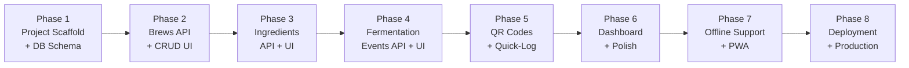

# BrewLog — Implementation Phases

> Incremental build plan derived from [ARCHITECTURE.md](../ARCHITECTURE.md).
> Each phase produces a working, testable slice of the application.

---

## Phase Overview

---

## Phase 1 — Project Scaffold & Database Schema

### Goal

Stand up the monorepo structure, configure tooling for both frontend and API, define the Drizzle schema, and run the first migration against Postgres. At the end of this phase you can run `dev` in both packages and hit a health-check endpoint.

### What Gets Built

| Area | Deliverables |
|------|-------------|
| **Monorepo root** | `package.json` with workspaces, shared `tsconfig.base.json`, `.gitignore`, `.env.example` files |
| **Frontend (`frontend/`)** | Vite + React 19 + TypeScript scaffold, Tailwind CSS configured, shadcn/ui initialized, React Router v7 with a placeholder root route, TanStack Query provider wired up, Zustand store skeleton |
| **API (`api/`)** | Serverless entry point (`src/index.ts`) with a lightweight router (Hono or manual), health-check `GET /api/health` endpoint, Drizzle ORM configured with `postgres-js` adapter |
| **Database** | Drizzle schema file (`api/src/db/schema.ts`) defining `brews`, `ingredients`, `fermentation_events` tables with all columns, indexes, and relations per the architecture. First migration generated and applied |
| **Auth middleware** | `api/src/middleware/auth.ts` — validates `X-API-Key` header on mutating requests, passes through on `GET` |
| **Shared validation** | `api/src/validators.ts` — Zod schemas for brew, ingredient, and event payloads |
| **API client** | `frontend/src/lib/api-client.ts` — fetch wrapper that attaches `X-API-Key` from `localStorage` and points at `VITE_API_URL` |

### Definition of Done

- [ ] `cd frontend && npm run dev` serves the React app at `localhost:5173` with a placeholder page
- [ ] `cd api && npm run dev` starts the serverless dev server and `GET /api/health` returns `200 OK`
- [ ] Drizzle migration creates all three tables in Postgres; `drizzle-kit studio` shows the schema
- [ ] Auth middleware rejects `POST /api/health-auth-test` without a valid `X-API-Key` and passes with one
- [ ] Zod schemas validate and reject malformed payloads in unit tests
- [ ] `api-client.ts` fetch wrapper includes the API key header when present in `localStorage`

### Dependencies

None — this is the foundation phase.

---

## Phase 2 — Brews API & Core Brew UI

### Goal

Implement full CRUD for brews on the API and build the create/edit/view brew pages on the frontend. At the end of this phase the user can create a brew, see it listed, view its detail page, edit it, change its status, and delete it.

### What Gets Built

| Area | Deliverables |
|------|-------------|
| **API routes** | `api/src/routes/brews.ts` — `GET /api/brews`, `GET /api/brews/:brewId`, `POST /api/brews`, `PUT /api/brews/:brewId`, `PATCH /api/brews/:brewId/status`, `DELETE /api/brews/:brewId` |
| **Frontend queries** | `frontend/src/lib/queries.ts` — TanStack Query hooks: `useBrews`, `useBrew` |
| **Frontend mutations** | `frontend/src/lib/mutations.ts` — TanStack Query mutations: `useCreateBrew`, `useUpdateBrew`, `useUpdateBrewStatus`, `useDeleteBrew` |
| **Route pages** | `dashboard.tsx` (minimal list of brews), `brews/new.tsx`, `brews/$brewId/index.tsx`, `brews/$brewId/edit.tsx`, `brews/$brewId/layout.tsx` |
| **Components** | `BrewForm` (create/edit), `BrewCard`, `BrewStatusBadge`, `BrewTypeIcon`, `BrewSummary` (basic version), `BrewDetailLayout` (tab shell with placeholder tabs) |
| **Layouts** | `RootLayout` with `AppNav` — top nav bar with logo and link to dashboard |
| **Types** | `frontend/src/lib/types.ts` — TypeScript types for Brew, BrewStatus, BrewType |
| **Utilities** | `frontend/src/lib/utils.ts` — ABV calculator, date formatting helpers |
| **Auth UX** | Simple "unlock" prompt on first visit to enter and store the API key in `localStorage` |

### Definition of Done

- [ ] Creating a brew via the form persists it to Postgres and redirects to the brew detail page
- [ ] Dashboard lists all brews ordered by `updated_at` desc
- [ ] Brew detail page shows name, type, batch size in liters, OG/FG targets, status, dates, and notes
- [ ] Edit brew form pre-fills current values and saves changes
- [ ] Status can be changed via the PATCH endpoint and reflected in the UI
- [ ] Deleting a brew removes it from the database and redirects to the dashboard
- [ ] Unauthenticated users can view brew details (GET) but cannot create/edit/delete
- [ ] API key unlock prompt appears on first visit; subsequent visits use the stored key

### Dependencies

Phase 1 — project scaffold, DB schema, auth middleware, API client.

---

## Phase 3 — Ingredients API & UI

### Goal

Add ingredient management to brews. The user can add, edit, and delete ingredients for any brew, with all quantities in metric units.

### What Gets Built

| Area | Deliverables |
|------|-------------|
| **API routes** | `api/src/routes/ingredients.ts` — `GET /api/brews/:brewId/ingredients`, `POST /api/brews/:brewId/ingredients`, `PUT /api/brews/:brewId/ingredients/:id`, `DELETE /api/brews/:brewId/ingredients/:id` |
| **Frontend queries** | `useIngredients` hook in `queries.ts` |
| **Frontend mutations** | `useAddIngredient`, `useUpdateIngredient`, `useDeleteIngredient` in `mutations.ts` |
| **Route page** | `brews/$brewId/ingredients.tsx` — ingredient list with inline add form |
| **Components** | `IngredientForm` (add/edit with category selector, metric unit picker: g/kg/ml/L), `IngredientTable`, `IngredientRow` (with edit/delete actions) |
| **Brew detail layout** | Wire up the Ingredients tab in `BrewDetailLayout` |

### Definition of Done

- [ ] Adding an ingredient via the form persists it and appears in the ingredient table
- [ ] Ingredient form enforces metric units only (g, kg, ml, L) via the unit selector
- [ ] Editing an ingredient updates the row in place
- [ ] Deleting an ingredient removes it with a confirmation
- [ ] Ingredient list is publicly readable (no auth required for GET)
- [ ] Deleting a brew cascades and removes its ingredients

### Dependencies

Phase 2 — brews API and brew detail layout with tab navigation.

---

## Phase 4 — Fermentation Events API & UI

### Goal

Implement the fermentation event log. The user can log gravity readings, temperature checks, racking events, tasting notes, and other events. A timeline view and gravity chart visualize the brew's progress.

### What Gets Built

| Area | Deliverables |
|------|-------------|
| **API routes** | `api/src/routes/events.ts` — `GET /api/brews/:brewId/events`, `POST /api/brews/:brewId/events`, `DELETE /api/brews/:brewId/events/:id` |
| **Frontend queries** | `useEvents` hook in `queries.ts` |
| **Frontend mutations** | `useAddEvent`, `useDeleteEvent` in `mutations.ts` |
| **Route page** | `brews/$brewId/log.tsx` — event timeline with add-event form |
| **Components** | `EventForm` (event type selector with dynamic fields per type), `EventTimeline`, `EventCard`, `EventTypeIcon`, `GravityChart` (Recharts line chart of gravity readings over time) |
| **Brew detail layout** | Wire up the Log tab in `BrewDetailLayout` |
| **Brew summary** | Update `BrewSummary` to show latest gravity, calculated ABV (if OG and latest gravity available), and event count |

### Definition of Done

- [ ] Logging a gravity reading shows it in the timeline and on the gravity chart
- [ ] Logging a temperature reading shows it in the timeline with °C unit
- [ ] All event types (gravity_reading, temperature, racking, addition, tasting, note, bottling, other) are supported
- [ ] Event form shows dynamic fields based on selected event type
- [ ] Events are ordered by `event_date` descending in the timeline
- [ ] Gravity chart plots gravity readings over time with date on x-axis
- [ ] Brew summary shows latest gravity, calculated ABV, and total event count
- [ ] Deleting an event removes it from the timeline
- [ ] Event list is publicly readable (no auth required for GET)
- [ ] Deleting a brew cascades and removes its events

### Dependencies

Phase 3 — ingredients (ensures the full brew detail tab structure is in place).

---

## Phase 5 — QR Codes & Quick-Log Flow

### Goal

Generate QR codes for brews and build the mobile-optimized quick-log page. After this phase, the user can print a QR label, stick it on a fermenter, scan it with a phone, and quickly log a reading.

### What Gets Built

| Area | Deliverables |
|------|-------------|
| **Route pages** | `brews/$brewId/qr.tsx` — QR code display page, `quick-log/$brewId.tsx` — mobile-optimized quick-log form |
| **Components** | `QrCodeDisplay` (renders QR via `qrcode.react` encoding `{APP_BASE_URL}/brews/{brewId}`), `QrDownloadButton` (save QR as PNG), `QrPrintButton` (print-friendly layout with brew name, type, start date, QR), `QuickLogForm` (large tap targets, event type selector, dynamic fields, defaults date to now) |
| **Brew detail layout** | Wire up the QR tab in `BrewDetailLayout` |
| **Brew detail page** | Add a "Quick Log" button visible only when authenticated, linking to `/quick-log/:brewId` |
| **Environment** | `VITE_APP_URL` env var used for QR URL generation |

### Definition of Done

- [ ] QR code page renders a QR encoding the correct brew URL
- [ ] Download button saves the QR as a PNG file
- [ ] Print button opens a print dialog with a label layout (brew name, type, date, QR)
- [ ] Scanning the QR on a phone opens the brew detail page (read-only for unauthenticated users)
- [ ] Authenticated users see a "Quick Log" button on the brew detail page
- [ ] Quick-log page is mobile-optimized with large tap targets
- [ ] Quick-log form supports all event types with appropriate dynamic fields
- [ ] Submitting the quick-log form creates an event and shows a success toast
- [ ] Quick-log page requires authentication (redirects or shows unlock prompt if no API key)
- [ ] 404 page shown if brew ID does not exist

### Dependencies

Phase 4 — fermentation events API (quick-log submits events via the same endpoint).

---

## Phase 6 — Dashboard Polish & Filtering

### Goal

Enhance the dashboard with status filtering, search, and a polished card layout. Add the 404 page and general UI polish across the app.

### What Gets Built

| Area | Deliverables |
|------|-------------|
| **Dashboard** | `StatusFilter` component — filter brews by status (planning, fermenting, conditioning, bottled, done), search/filter by brew name, brew cards grouped or sorted by status |
| **Components** | Polished `BrewCard` with status badge, type icon, batch size, age calculation, latest gravity |
| **Route** | `not-found.tsx` — 404 page with link back to dashboard |
| **UI polish** | Responsive layout for all pages (mobile + desktop), loading skeletons for data fetching states, error boundaries and error states, toast notifications for all mutations (create, update, delete), consistent spacing, typography, and color scheme |

### Definition of Done

- [ ] Dashboard filters brews by status with visual indication of active filter
- [ ] Dashboard search filters brews by name (client-side)
- [ ] Brew cards show status badge, type icon, batch size in L, brew age, and latest gravity
- [ ] 404 page renders for unknown routes with a link to the dashboard
- [ ] All pages are responsive and usable on mobile screens
- [ ] Loading states show skeleton placeholders
- [ ] Error states show user-friendly messages
- [ ] All create/update/delete operations show toast notifications

### Dependencies

Phase 5 — all core features are built; this phase polishes the experience.

---

## Phase 7 — Offline Support & PWA

### Goal

Add Service Worker caching, IndexedDB data persistence, and an offline write queue so the app works reliably at the fermenter with spotty WiFi.

### What Gets Built

| Area | Deliverables |
|------|-------------|
| **Service Worker** | `vite-plugin-pwa` configured in `vite.config.ts` — caches static assets (HTML, JS, CSS) for offline app shell loading |
| **IndexedDB cache** | `frontend/src/lib/offline.ts` — uses `idb` library to cache API responses (brew list, brew details, ingredients, events) in IndexedDB |
| **Outbox queue** | Offline write operations saved to an IndexedDB "outbox" store with request method, URL, and body |
| **Background sync** | `frontend/src/lib/sync.ts` — on connectivity restore, replays queued writes to the API in order, clears synced items |
| **Sync status UI** | `SyncStatus` component — shows pending sync count in the nav bar, toast notifications on successful sync |
| **Zustand integration** | `frontend/src/lib/store.ts` — online/offline state, pending sync count, sync-in-progress flag |
| **TanStack Query integration** | Configure `staleTime` and `gcTime` for offline-friendly caching; on reconnection trigger refetch of stale queries |
| **Service Worker registration** | `frontend/src/sw.ts` — register the service worker on app load |

### Definition of Done

- [ ] App shell loads when device is offline (cached static assets)
- [ ] Previously viewed brew data is available offline from IndexedDB
- [ ] Logging an event while offline queues it in the outbox and shows a "pending sync" indicator
- [ ] When connectivity is restored, queued writes are automatically synced to the API
- [ ] Successful sync clears the outbox and shows a toast notification
- [ ] Sync status component shows the count of pending operations
- [ ] QR code generation works offline (client-side rendering)
- [ ] Creating a brew offline queues it with a client-generated nanoid
- [ ] Delete operations queued offline show a warning to the user

### Dependencies

Phase 6 — all UI is complete; offline layer wraps the existing data flow.

---

## Phase 8 — Deployment & Production Readiness

### Goal

Deploy the frontend to a static host and the API to a serverless provider. Configure environment variables, CORS, and verify the full end-to-end flow in production.

### What Gets Built

| Area | Deliverables |
|------|-------------|
| **Frontend deployment** | Deploy to Cloudflare Pages, Netlify, or Vercel (static). Configure `VITE_APP_URL` and `VITE_API_URL` for production |
| **API deployment** | Deploy to Cloudflare Workers, Vercel Functions, or Netlify Functions. Configure `DATABASE_URL` and `API_KEY` as secrets |
| **CORS** | API configured to allow requests from the frontend origin |
| **Build scripts** | Production build commands in both `package.json` files |
| **README** | `README.md` with setup instructions, environment variable reference, deployment guide, and development workflow |
| **Environment files** | `.env.example` files for both frontend and API documenting all required variables |

### Definition of Done

- [ ] Frontend is live at a public URL and loads the app
- [ ] API is live and responds to requests from the frontend
- [ ] CORS is configured correctly — no cross-origin errors in the browser
- [ ] Creating, reading, updating, and deleting brews works end-to-end in production
- [ ] QR codes encode the production URL and scanning them opens the correct brew page
- [ ] Quick-log flow works on a mobile device in production
- [ ] Offline mode works in production (Service Worker caches assets, IndexedDB caches data)
- [ ] `README.md` documents how to set up, develop, and deploy the app
- [ ] All environment variables are documented in `.env.example` files

### Dependencies

Phase 7 — all features including offline support are complete.

---

## Phase Summary

| Phase | Name | Key Outcome |
|-------|------|-------------|
| 1 | Project Scaffold & DB Schema | Dev environment running, DB tables created, auth middleware working |
| 2 | Brews API & Core Brew UI | Full brew CRUD with create, list, detail, edit, status change, delete |
| 3 | Ingredients API & UI | Add, edit, delete ingredients with metric units |
| 4 | Fermentation Events API & UI | Event logging, timeline view, gravity chart |
| 5 | QR Codes & Quick-Log | QR generation, print/download, mobile quick-log form |
| 6 | Dashboard Polish & Filtering | Status filters, search, responsive polish, error/loading states |
| 7 | Offline Support & PWA | Service Worker, IndexedDB cache, offline write queue, background sync |
| 8 | Deployment & Production | Live deployment, CORS, README, end-to-end verification |
