# BrewLog — Granular Task Breakdown

> Derived from [ARCHITECTURE.md](../ARCHITECTURE.md) and [IMPLEMENTATION_PHASES.md](./IMPLEMENTATION_PHASES.md).
> Each task is self-contained, ordered, and designed for an AI coding agent to execute in a single session.

---

## Phase 1 — Project Scaffold & Database Schema

### P1-T1: Initialize monorepo root and workspace configuration

**Description**: Create the monorepo root with npm workspaces configured for `frontend/` and `api/`. Set up shared TypeScript config, `.gitignore`, and `.env.example` files.

**Files to create/modify**:
- `package.json` (root — workspaces: `["frontend", "api"]`)
- `tsconfig.base.json` (shared TS config with strict mode, ES2022 target)
- `.gitignore` (node_modules, dist, .env, .wrangler)
- `.env.example` (document `DATABASE_URL`, `API_KEY`, `VITE_APP_URL`, `VITE_API_URL`)

**Dependencies**: None

**Acceptance criteria**:
- `npm install` at root installs dependencies for both workspaces
- `tsconfig.base.json` exists and is valid JSON with `strict: true`
- `.gitignore` covers node_modules, dist, .env, .wrangler
- `.env.example` documents all required environment variables

**Complexity**: S

---

### P1-T2: Scaffold frontend with Vite + React 19 + TypeScript

**Description**: Initialize the `frontend/` package with Vite, React 19, and TypeScript. Configure `vite.config.ts` with the React plugin. Create the entry point `main.tsx`, a placeholder `App.tsx` with a "BrewLog" heading, and `index.css` with Tailwind directives.

**Files to create/modify**:
- `frontend/package.json` (react, react-dom, vite, @vitejs/plugin-react, typescript)
- `frontend/tsconfig.json` (extends `../tsconfig.base.json`)
- `frontend/vite.config.ts` (React plugin)
- `frontend/index.html`
- `frontend/src/main.tsx` (ReactDOM.createRoot render)
- `frontend/src/App.tsx` (placeholder with "BrewLog" heading)
- `frontend/src/index.css` (Tailwind `@tailwind` directives)

**Dependencies**: P1-T1

**Acceptance criteria**:
- `cd frontend && npm run dev` starts Vite dev server at `localhost:5173`
- Browser shows a page with "BrewLog" heading
- TypeScript compiles without errors

**Complexity**: S

---

### P1-T3: Configure Tailwind CSS and initialize shadcn/ui

**Description**: Install and configure Tailwind CSS v4 with PostCSS and Autoprefixer. Initialize shadcn/ui with the default theme. Install utility dependencies: `clsx`, `tailwind-merge`, `class-variance-authority`, `lucide-react`.

**Files to create/modify**:
- `frontend/tailwind.config.ts`
- `frontend/postcss.config.js`
- `frontend/src/index.css` (update with Tailwind config and shadcn/ui CSS variables)
- `frontend/components.json` (shadcn/ui config)
- `frontend/src/lib/utils.ts` (create `cn()` helper using `clsx` + `tailwind-merge`)

**Dependencies**: P1-T2

**Acceptance criteria**:
- Tailwind utility classes render correctly in the browser (e.g., `className="text-red-500"` shows red text)
- `cn()` utility function is exported from `frontend/src/lib/utils.ts`
- shadcn/ui is initialized and `components.json` exists
- `lucide-react` icons can be imported

**Complexity**: S

---

### P1-T4: Set up React Router v7 with placeholder root route

**Description**: Install `react-router` v7. Configure client-side routing in `App.tsx` with a `BrowserRouter`. Create the root layout route (`routes/root.tsx`) and a placeholder dashboard route (`routes/dashboard.tsx`).

**Files to create/modify**:
- `frontend/src/App.tsx` (add BrowserRouter, route definitions)
- `frontend/src/routes/root.tsx` (root layout with `<Outlet />`)
- `frontend/src/routes/dashboard.tsx` (placeholder "Dashboard" page)

**Dependencies**: P1-T2

**Acceptance criteria**:
- Navigating to `/` renders the root layout with the dashboard content
- Root layout renders an `<Outlet />` for nested routes
- No console errors related to routing

**Complexity**: S

---

### P1-T5: Wire up TanStack Query provider and Zustand store skeleton

**Description**: Install `@tanstack/react-query` and `zustand`. Create the QueryClient provider in `App.tsx`. Create a Zustand store skeleton at `frontend/src/lib/store.ts` with initial state for auth (apiKey, isAuthenticated) and sync status (isOnline, pendingSyncCount).

**Files to create/modify**:
- `frontend/src/App.tsx` (wrap app in `QueryClientProvider`)
- `frontend/src/lib/store.ts` (Zustand store with auth + sync state)

**Dependencies**: P1-T4

**Acceptance criteria**:
- `QueryClientProvider` wraps the app in `App.tsx`
- Zustand store exports `useAppStore` hook with `apiKey`, `isAuthenticated`, `isOnline`, `pendingSyncCount` state
- Store has actions: `setApiKey`, `clearApiKey`, `setOnline`, `setPendingSyncCount`
- No runtime errors on page load

**Complexity**: S

---

### P1-T6: Scaffold API with Hono and health-check endpoint

**Description**: Initialize the `api/` package. Install `hono` as the lightweight router. Create the entry point `api/src/index.ts` with a Hono app that serves `GET /api/health` returning `{ status: "ok" }`. Configure for local development with `wrangler` (Cloudflare Workers).

**Files to create/modify**:
- `api/package.json` (hono, wrangler, typescript)
- `api/tsconfig.json` (extends `../tsconfig.base.json`)
- `api/src/index.ts` (Hono app with health endpoint)
- `api/wrangler.toml` (Cloudflare Workers config for local dev)

**Dependencies**: P1-T1

**Acceptance criteria**:
- `cd api && npm run dev` starts the dev server (wrangler or node)
- `GET /api/health` returns `200` with `{ "status": "ok" }`
- TypeScript compiles without errors

**Complexity**: S

---

### P1-T7: Define Drizzle ORM schema for all tables

**Description**: Install `drizzle-orm`, `postgres` (postgres-js driver), `nanoid`, and `drizzle-kit`. Create the Drizzle schema file defining `brews`, `ingredients`, and `fermentation_events` tables with all columns, types, defaults, foreign keys, indexes, and relations as specified in the architecture.

**Files to create/modify**:
- `api/src/db/schema.ts` (Drizzle table definitions for brews, ingredients, fermentation_events with relations)
- `api/src/db/index.ts` (Drizzle client creation using `postgres-js` adapter, reads `DATABASE_URL` from env)

**Dependencies**: P1-T6

**Acceptance criteria**:
- `schema.ts` defines `brews`, `ingredients`, `fermentationEvents` tables matching the architecture exactly
- All columns have correct types: `text` for IDs/strings, `real` for numbers, `timestamp` for timestamps
- Foreign keys: `ingredients.brew_id` → `brews.id`, `fermentation_events.brew_id` → `brews.id`
- Indexes on `ingredients.brew_id` and `fermentation_events.brew_id`
- Relations defined between brews ↔ ingredients and brews ↔ fermentation_events
- `nanoid` used for default ID generation
- `db/index.ts` exports a configured Drizzle client

**Complexity**: M

---

### P1-T8: Generate and apply first Drizzle migration

**Description**: Configure `drizzle-kit` for migration generation. Generate the initial migration from the schema and document how to apply it. Create a `drizzle.config.ts` at the API root.

**Files to create/modify**:
- `api/drizzle.config.ts` (drizzle-kit config pointing to schema and `DATABASE_URL`)
- `api/package.json` (add scripts: `db:generate`, `db:migrate`, `db:studio`)

**Dependencies**: P1-T7

**Acceptance criteria**:
- `npm run db:generate` in `api/` creates a migration SQL file in `api/src/db/migrations/`
- Migration SQL creates all three tables with correct columns, constraints, and indexes
- `npm run db:studio` launches Drizzle Studio (when DATABASE_URL is configured)
- Migration scripts are documented in package.json

**Complexity**: S

---

### P1-T9: Implement API key auth middleware

**Description**: Create the auth middleware at `api/src/middleware/auth.ts`. It should check for the `X-API-Key` header on all non-GET requests. Compare against the `API_KEY` environment variable. Return `401 Unauthorized` if missing or incorrect. Pass through on GET requests.

**Files to create/modify**:
- `api/src/middleware/auth.ts` (Hono middleware function)
- `api/src/index.ts` (apply auth middleware globally)

**Dependencies**: P1-T6

**Acceptance criteria**:
- GET requests pass through without auth check
- POST/PUT/PATCH/DELETE requests without `X-API-Key` header return `401`
- POST/PUT/PATCH/DELETE requests with incorrect `X-API-Key` return `401`
- POST/PUT/PATCH/DELETE requests with correct `X-API-Key` pass through
- Error response body is `{ "error": "Unauthorized" }`

**Complexity**: S

---

### P1-T10: Create Zod validation schemas

**Description**: Create Zod schemas for all API request payloads: create/update brew, create/update ingredient, create event. Define enums for brew type, brew status, ingredient category, ingredient unit, and event type.

**Files to create/modify**:
- `api/src/validators.ts` (all Zod schemas and enums)

**Dependencies**: P1-T6

**Acceptance criteria**:
- `createBrewSchema` validates: name (required string), type (enum: beer/mead/cider), batch_size_liters (positive number), target_og (optional number), target_fg (optional number), status (enum with default "fermenting"), start_date (ISO date string), end_date (optional), notes (optional)
- `updateBrewSchema` is a partial version of createBrewSchema
- `updateBrewStatusSchema` validates: status (enum: planning/fermenting/conditioning/bottled/done)
- `createIngredientSchema` validates: category (enum: grain/hop/honey/fruit/yeast/adjunct/other), name (required), quantity (positive number), unit (enum: g/kg/ml/L), date_added (optional), notes (optional)
- `updateIngredientSchema` is a partial version of createIngredientSchema
- `createEventSchema` validates: event_type (enum: gravity_reading/temperature/racking/addition/tasting/note/bottling/other), gravity (optional number), temperature_celsius (optional number), notes (optional), event_date (required ISO datetime)
- All schemas reject invalid data and return descriptive error messages

**Complexity**: M

---

### P1-T11: Create frontend API client with auth header

**Description**: Create the fetch wrapper at `frontend/src/lib/api-client.ts` that reads the API key from the Zustand store (or localStorage) and attaches it as `X-API-Key` header on all requests. Base URL comes from `VITE_API_URL` env var. Include typed helper methods for GET, POST, PUT, PATCH, DELETE.

**Files to create/modify**:
- `frontend/src/lib/api-client.ts` (fetch wrapper with typed methods)
- `frontend/.env` (VITE_API_URL=http://localhost:8787)
- `frontend/.env.example` (document VITE_API_URL, VITE_APP_URL)

**Dependencies**: P1-T5

**Acceptance criteria**:
- `apiClient.get("/brews")` sends GET to `{VITE_API_URL}/api/brews` without auth header
- `apiClient.post("/brews", body)` sends POST with `X-API-Key` header and JSON body
- `apiClient.put`, `apiClient.patch`, `apiClient.delete` all include the API key header
- Responses are parsed as JSON automatically
- Non-2xx responses throw an error with the response body

**Complexity**: S

---

### P1-T12: Create frontend TypeScript types

**Description**: Define shared TypeScript types and enums for the frontend matching the database schema and API contracts.

**Files to create/modify**:
- `frontend/src/lib/types.ts` (Brew, Ingredient, FermentationEvent interfaces; BrewStatus, BrewType, IngredientCategory, IngredientUnit, EventType enums/unions)

**Dependencies**: P1-T2

**Acceptance criteria**:
- `Brew` type has all fields from the brews table
- `Ingredient` type has all fields from the ingredients table
- `FermentationEvent` type has all fields from the fermentation_events table
- Status/type enums match the Zod schemas exactly
- All types are exported

**Complexity**: S

---

## Phase 2 — Brews API & Core Brew UI

### P2-T1: Implement brews API routes (CRUD)

**Description**: Create `api/src/routes/brews.ts` with all brew CRUD endpoints. Use Drizzle ORM for database operations and Zod schemas for validation. Register routes in `api/src/index.ts`.

**Files to create/modify**:
- `api/src/routes/brews.ts` (GET list, GET by ID, POST create, PUT update, PATCH status, DELETE)
- `api/src/index.ts` (register brew routes)

**Dependencies**: P1-T7, P1-T8, P1-T9, P1-T10

**Acceptance criteria**:
- `GET /api/brews` returns all brews ordered by `updated_at` desc
- `GET /api/brews/:brewId` returns a single brew with ingredient and event counts
- `POST /api/brews` creates a brew with nanoid, validates body with Zod, returns 201
- `PUT /api/brews/:brewId` updates brew fields, validates body, returns updated brew
- `PATCH /api/brews/:brewId/status` updates only the status field
- `DELETE /api/brews/:brewId` deletes the brew and cascades to ingredients/events
- Invalid payloads return 400 with Zod error details
- Non-existent brewId returns 404

**Complexity**: M

---

### P2-T2: Create RootLayout and AppNav components

**Description**: Build the root layout with a top navigation bar. The nav includes the BrewLog logo/title and a link to the dashboard. Use shadcn/ui components (install Button, etc. via shadcn CLI).

**Files to create/modify**:
- `frontend/src/layouts/root-layout.tsx` (HTML shell with nav + `<Outlet />`)
- `frontend/src/components/app-nav.tsx` (top nav bar with logo, dashboard link)
- `frontend/src/routes/root.tsx` (update to use RootLayout)

**Dependencies**: P1-T3, P1-T4

**Acceptance criteria**:
- Root layout renders a navigation bar at the top and page content below
- Nav bar shows "BrewLog" title/logo and a link to `/` (dashboard)
- Layout is responsive — nav collapses appropriately on mobile
- `<Outlet />` renders child route content

**Complexity**: S

---

### P2-T3: Build BrewForm component (create/edit)

**Description**: Create the `BrewForm` component used for both creating and editing brews. Fields: name, type (beer/mead/cider selector), batch size in liters, target OG, target FG, status, start date, end date, notes. Use shadcn/ui form components (install Input, Select, Textarea, Label, Card via shadcn CLI).

**Files to create/modify**:
- `frontend/src/components/forms/brew-form.tsx` (form component with all fields)
- `frontend/src/components/ui/` (install required shadcn/ui components: input, select, textarea, label, card, button)

**Dependencies**: P2-T2, P1-T12

**Acceptance criteria**:
- Form renders all fields: name, type selector, batch_size_liters, target_og, target_fg, status, start_date, end_date, notes
- Type selector offers: beer, mead, cider
- Status selector offers: planning, fermenting, conditioning, bottled, done
- Batch size label shows "L" unit
- Form accepts an `onSubmit` callback and optional `defaultValues` for edit mode
- Client-side validation: name and type are required, batch_size_liters must be positive

**Complexity**: M

---

### P2-T4: Create TanStack Query hooks for brews

**Description**: Create query hooks (`useBrews`, `useBrew`) and mutation hooks (`useCreateBrew`, `useUpdateBrew`, `useUpdateBrewStatus`, `useDeleteBrew`) using TanStack Query and the API client.

**Files to create/modify**:
- `frontend/src/lib/queries.ts` (useBrews, useBrew query hooks)
- `frontend/src/lib/mutations.ts` (useCreateBrew, useUpdateBrew, useUpdateBrewStatus, useDeleteBrew mutation hooks)

**Dependencies**: P1-T11, P1-T12

**Acceptance criteria**:
- `useBrews()` fetches `GET /api/brews` and returns typed `Brew[]`
- `useBrew(brewId)` fetches `GET /api/brews/:brewId` and returns typed `Brew`
- `useCreateBrew()` posts to `POST /api/brews` and invalidates the brews query cache
- `useUpdateBrew()` puts to `PUT /api/brews/:brewId` and invalidates both brews list and single brew cache
- `useUpdateBrewStatus()` patches `PATCH /api/brews/:brewId/status` and invalidates caches
- `useDeleteBrew()` deletes via `DELETE /api/brews/:brewId` and invalidates the brews list cache
- All hooks handle loading and error states

**Complexity**: M

---

### P2-T5: Build BrewCard, BrewStatusBadge, and BrewTypeIcon components

**Description**: Create the brew card component for the dashboard list, the status badge, and the type icon. Install shadcn/ui Badge component.

**Files to create/modify**:
- `frontend/src/components/brew-card.tsx` (card showing name, type icon, status badge, batch size, dates)
- `frontend/src/components/brew-status-badge.tsx` (colored badge per status)
- `frontend/src/components/brew-type-icon.tsx` (icon for beer/mead/cider using lucide-react)

**Dependencies**: P2-T2, P1-T12

**Acceptance criteria**:
- `BrewCard` displays brew name, type icon, status badge, batch size in L, and start date
- `BrewCard` links to `/brews/:brewId` on click
- `BrewStatusBadge` renders different colors per status (e.g., fermenting=yellow, done=green)
- `BrewTypeIcon` renders distinct icons for beer, mead, and cider

**Complexity**: S

---

### P2-T6: Build utility functions (ABV calculator, date formatting)

**Description**: Create utility functions for ABV calculation and date formatting using `date-fns`.

**Files to create/modify**:
- `frontend/src/lib/utils.ts` (add `calculateABV(og, fg)`, `formatDate(date)`, `formatDateTime(date)`, `brewAge(startDate)` functions alongside existing `cn()`)

**Dependencies**: P1-T3

**Acceptance criteria**:
- `calculateABV(1.050, 1.010)` returns approximately `5.25` (using standard ABV formula: `(OG - FG) * 131.25`)
- `formatDate("2025-01-15")` returns a human-readable date string
- `formatDateTime("2025-01-15T14:30:00Z")` returns a human-readable datetime string
- `brewAge("2025-01-01")` returns a string like "45 days" based on current date
- All functions handle null/undefined inputs gracefully

**Complexity**: S

---

### P2-T7: Build dashboard page with brew list

**Description**: Implement the dashboard route page that fetches and displays all brews using `useBrews()`. Show brews as a list of `BrewCard` components. Include a "New Brew" button linking to `/brews/new`.

**Files to create/modify**:
- `frontend/src/routes/dashboard.tsx` (fetch brews, render BrewCard list)
- `frontend/src/components/brew-dashboard.tsx` (dashboard content component)
- `frontend/src/App.tsx` (ensure dashboard route is registered at `/`)

**Dependencies**: P2-T4, P2-T5

**Acceptance criteria**:
- Dashboard fetches brews via `useBrews()` and displays them as cards
- Brews are ordered by `updated_at` descending
- "New Brew" button links to `/brews/new`
- Loading state shows while fetching
- Empty state shows a message when no brews exist

**Complexity**: S

---

### P2-T8: Build create brew page

**Description**: Implement the `/brews/new` route page with the `BrewForm`. On submit, call `useCreateBrew()` and redirect to the new brew's detail page.

**Files to create/modify**:
- `frontend/src/routes/brews/new.tsx` (create brew page using BrewForm)
- `frontend/src/App.tsx` (register `/brews/new` route)

**Dependencies**: P2-T3, P2-T4

**Acceptance criteria**:
- `/brews/new` renders the BrewForm in create mode
- Submitting the form creates a brew via the API
- On success, redirects to `/brews/:newBrewId`
- On error, shows an error message
- Form validation prevents submission of invalid data

**Complexity**: S

---

### P2-T9: Build brew detail layout with tab navigation

**Description**: Create the `BrewDetailLayout` with tab navigation for brew sub-pages (Overview, Ingredients, Log, QR). Create the brew overview/summary page.

**Files to create/modify**:
- `frontend/src/layouts/brew-detail-layout.tsx` (tab navigation: Overview, Ingredients, Log, QR)
- `frontend/src/routes/brews/$brewId/layout.tsx` (uses BrewDetailLayout, fetches brew data)
- `frontend/src/routes/brews/$brewId/index.tsx` (brew overview/summary page)
- `frontend/src/components/brew-summary.tsx` (basic version: name, type, batch size, OG/FG, status, dates, notes)
- `frontend/src/App.tsx` (register `/brews/:brewId/*` routes)

**Dependencies**: P2-T4, P2-T5, P2-T6

**Acceptance criteria**:
- `/brews/:brewId` renders the brew detail layout with tabs
- Overview tab shows brew summary: name, type, batch size (L), OG/FG targets, status, dates, notes
- Tab navigation links to Overview, Ingredients, Log, QR sub-pages
- Active tab is visually highlighted
- Non-existent brewId shows a 404 or error state

**Complexity**: M

---

### P2-T10: Build edit brew page

**Description**: Implement the `/brews/:brewId/edit` route with the `BrewForm` pre-filled with current brew data. On submit, call `useUpdateBrew()`.

**Files to create/modify**:
- `frontend/src/routes/brews/$brewId/edit.tsx` (edit brew page using BrewForm with defaultValues)
- `frontend/src/App.tsx` (register `/brews/:brewId/edit` route)

**Dependencies**: P2-T3, P2-T4, P2-T9

**Acceptance criteria**:
- `/brews/:brewId/edit` renders the BrewForm pre-filled with current brew values
- Submitting saves changes via `useUpdateBrew()`
- On success, redirects to `/brews/:brewId`
- Edit link/button is accessible from the brew detail page

**Complexity**: S

---

### P2-T11: Implement auth unlock prompt

**Description**: Build a simple "unlock" dialog that prompts the user to enter their API key on first visit (when no key is in localStorage). Store the key in the Zustand store and localStorage. Show the prompt when a write operation is attempted without a stored key.

**Files to create/modify**:
- `frontend/src/components/auth-prompt.tsx` (dialog/modal for entering API key)
- `frontend/src/layouts/root-layout.tsx` (integrate auth prompt)
- `frontend/src/lib/store.ts` (persist apiKey to localStorage, hydrate on load)

**Dependencies**: P1-T5, P2-T2

**Acceptance criteria**:
- On first visit with no stored API key, an unlock prompt appears
- User can enter their API key and submit
- Key is stored in localStorage and Zustand store
- Subsequent visits auto-load the key from localStorage
- Write operations include the stored API key in the `X-API-Key` header
- User can clear/change the API key (settings or re-prompt)

**Complexity**: M

---

## Phase 3 — Ingredients API & UI

### P3-T1: Implement ingredients API routes

**Description**: Create `api/src/routes/ingredients.ts` with CRUD endpoints for ingredients scoped to a brew. Register routes in `api/src/index.ts`.

**Files to create/modify**:
- `api/src/routes/ingredients.ts` (GET list, POST create, PUT update, DELETE)
- `api/src/index.ts` (register ingredient routes)

**Dependencies**: P2-T1

**Acceptance criteria**:
- `GET /api/brews/:brewId/ingredients` returns all ingredients for the brew
- `POST /api/brews/:brewId/ingredients` creates an ingredient with nanoid, validates with Zod, returns 201
- `PUT /api/brews/:brewId/ingredients/:id` updates an ingredient, validates with Zod
- `DELETE /api/brews/:brewId/ingredients/:id` deletes an ingredient
- Returns 404 if brew or ingredient not found
- Invalid payloads return 400 with error details

**Complexity**: M

---

### P3-T2: Create TanStack Query hooks for ingredients

**Description**: Add query and mutation hooks for ingredients to the existing query/mutation files.

**Files to create/modify**:
- `frontend/src/lib/queries.ts` (add `useIngredients(brewId)` hook)
- `frontend/src/lib/mutations.ts` (add `useAddIngredient`, `useUpdateIngredient`, `useDeleteIngredient` hooks)

**Dependencies**: P2-T4, P3-T1

**Acceptance criteria**:
- `useIngredients(brewId)` fetches ingredients for a brew and returns typed `Ingredient[]`
- `useAddIngredient()` posts to the ingredients endpoint and invalidates the ingredients cache
- `useUpdateIngredient()` puts to the ingredient endpoint and invalidates cache
- `useDeleteIngredient()` deletes and invalidates cache

**Complexity**: S

---

### P3-T3: Build IngredientForm component

**Description**: Create the ingredient form with fields for category, name, quantity, unit, date added, and notes. Category selector: grain/hop/honey/fruit/yeast/adjunct/other. Unit selector: g/kg/ml/L (metric only).

**Files to create/modify**:
- `frontend/src/components/forms/ingredient-form.tsx` (form with all fields, category and unit selectors)

**Dependencies**: P2-T2, P1-T12

**Acceptance criteria**:
- Form renders fields: category selector, name input, quantity input, unit selector, date_added, notes
- Category options: grain, hop, honey, fruit, yeast, adjunct, other
- Unit options: g, kg, ml, L (metric only)
- Form accepts `onSubmit` callback and optional `defaultValues` for edit mode
- Validation: category, name, quantity, and unit are required; quantity must be positive

**Complexity**: S

---

### P3-T4: Build IngredientTable and IngredientRow components

**Description**: Create the ingredient table and row components with edit and delete actions. Install shadcn/ui Table and Dialog components.

**Files to create/modify**:
- `frontend/src/components/ingredient-table.tsx` (table rendering list of IngredientRow)
- `frontend/src/components/ingredient-row.tsx` (single row with edit/delete buttons)
- `frontend/src/components/ui/` (install shadcn/ui table, dialog if not already present)

**Dependencies**: P3-T3, P1-T12

**Acceptance criteria**:
- Table displays columns: category, name, quantity + unit, date added, notes, actions
- Each row has edit and delete action buttons
- Edit button opens the IngredientForm in edit mode (inline or dialog)
- Delete button shows a confirmation before deleting
- Empty state message when no ingredients exist

**Complexity**: M

---

### P3-T5: Build ingredients route page and wire up tab

**Description**: Create the ingredients route page that combines the IngredientForm (for adding) and IngredientTable (for listing). Wire up the Ingredients tab in the brew detail layout.

**Files to create/modify**:
- `frontend/src/routes/brews/$brewId/ingredients.tsx` (ingredients page with form + table)
- `frontend/src/App.tsx` (register `/brews/:brewId/ingredients` route)

**Dependencies**: P3-T2, P3-T3, P3-T4, P2-T9

**Acceptance criteria**:
- `/brews/:brewId/ingredients` shows the ingredient list and add form
- Adding an ingredient via the form appears in the table immediately
- Editing an ingredient updates the row
- Deleting an ingredient removes it with confirmation
- Ingredients tab is active/highlighted in the brew detail layout
- Page is publicly readable (no auth required for viewing)

**Complexity**: S

---

## Phase 4 — Fermentation Events API & UI

### P4-T1: Implement fermentation events API routes

**Description**: Create `api/src/routes/events.ts` with endpoints for listing, creating, and deleting fermentation events. Register routes in `api/src/index.ts`.

**Files to create/modify**:
- `api/src/routes/events.ts` (GET list, POST create, DELETE)
- `api/src/index.ts` (register event routes)

**Dependencies**: P2-T1

**Acceptance criteria**:
- `GET /api/brews/:brewId/events` returns all events ordered by `event_date` descending
- `POST /api/brews/:brewId/events` creates an event with nanoid, validates with Zod, returns 201
- `DELETE /api/brews/:brewId/events/:id` deletes an event
- Returns 404 if brew or event not found
- Invalid payloads return 400 with error details

**Complexity**: M

---

### P4-T2: Create TanStack Query hooks for events

**Description**: Add query and mutation hooks for fermentation events.

**Files to create/modify**:
- `frontend/src/lib/queries.ts` (add `useEvents(brewId)` hook)
- `frontend/src/lib/mutations.ts` (add `useAddEvent`, `useDeleteEvent` hooks)

**Dependencies**: P2-T4, P4-T1

**Acceptance criteria**:
- `useEvents(brewId)` fetches events for a brew and returns typed `FermentationEvent[]`
- `useAddEvent()` posts to the events endpoint and invalidates the events cache
- `useDeleteEvent()` deletes and invalidates cache

**Complexity**: S

---

### P4-T3: Build EventForm component with dynamic fields

**Description**: Create the event form with an event type selector and dynamic fields that change based on the selected type. Event types: gravity_reading, temperature, racking, addition, tasting, note, bottling, other.

**Files to create/modify**:
- `frontend/src/components/forms/event-form.tsx` (form with event type selector and dynamic fields)

**Dependencies**: P2-T2, P1-T12

**Acceptance criteria**:
- Event type selector shows all 8 event types
- Selecting "gravity_reading" shows gravity input field
- Selecting "temperature" shows temperature input with °C label
- Selecting "tasting" shows notes textarea
- Selecting "racking" shows notes textarea
- Selecting "addition" shows name, quantity, unit, and notes fields
- Selecting "note" shows notes textarea
- Selecting "bottling" shows notes textarea
- Selecting "other" shows notes textarea
- Date/time field defaults to current datetime, is editable
- Form accepts `onSubmit` callback

**Complexity**: M

---

### P4-T4: Build EventTimeline, EventCard, and EventTypeIcon components

**Description**: Create the event timeline view showing events in chronological order, with cards for each event and icons per event type.

**Files to create/modify**:
- `frontend/src/components/event-timeline.tsx` (chronological list of EventCard components)
- `frontend/src/components/event-card.tsx` (single event display with type icon, data, date, delete button)
- `frontend/src/components/event-type-icon.tsx` (icon per event type using lucide-react)

**Dependencies**: P1-T12

**Acceptance criteria**:
- Timeline renders events in `event_date` descending order
- Each card shows: event type icon, event type label, relevant data (gravity, temperature, notes), event date
- Gravity readings display the gravity value
- Temperature readings display value with °C
- Delete button on each card (visible when authenticated)
- Empty state message when no events exist

**Complexity**: M

---

### P4-T5: Build GravityChart component

**Description**: Create a line chart of gravity readings over time using Recharts. Install `recharts`.

**Files to create/modify**:
- `frontend/src/components/gravity-chart.tsx` (Recharts LineChart plotting gravity vs event_date)

**Dependencies**: P4-T2, P1-T12

**Acceptance criteria**:
- Chart plots gravity readings (y-axis) over event_date (x-axis)
- Only events with `event_type === "gravity_reading"` and a gravity value are plotted
- X-axis shows formatted dates
- Y-axis shows gravity values (e.g., 1.000–1.100)
- Chart is responsive and resizes with container
- Shows a message or is hidden when no gravity readings exist

**Complexity**: M

---

### P4-T6: Build fermentation log route page and wire up tab

**Description**: Create the log route page combining EventForm, EventTimeline, and GravityChart. Wire up the Log tab in the brew detail layout.

**Files to create/modify**:
- `frontend/src/routes/brews/$brewId/log.tsx` (log page with form, timeline, chart)
- `frontend/src/App.tsx` (register `/brews/:brewId/log` route)

**Dependencies**: P4-T2, P4-T3, P4-T4, P4-T5, P2-T9

**Acceptance criteria**:
- `/brews/:brewId/log` shows the gravity chart, event form, and event timeline
- Adding an event via the form appears in the timeline immediately
- Gravity readings appear on the chart
- Deleting an event removes it from the timeline and chart
- Log tab is active/highlighted in the brew detail layout
- Page is publicly readable (no auth required for viewing)

**Complexity**: S

---

### P4-T7: Update BrewSummary with event data

**Description**: Enhance the `BrewSummary` component to show the latest gravity reading, calculated ABV (if OG and latest gravity are available), and total event count.

**Files to create/modify**:
- `frontend/src/components/brew-summary.tsx` (add latest gravity, ABV calculation, event count)
- `frontend/src/routes/brews/$brewId/index.tsx` (pass event data to BrewSummary)

**Dependencies**: P4-T2, P2-T6, P2-T9

**Acceptance criteria**:
- Brew summary shows latest gravity reading (if any)
- If brew has target_og and at least one gravity reading, shows calculated ABV
- Shows total event count
- Shows total ingredient count
- Handles case where no events or ingredients exist gracefully

**Complexity**: S

---

## Phase 5 — QR Codes & Quick-Log Flow

### P5-T1: Build QrCodeDisplay and QrDownloadButton components

**Description**: Create the QR code display component using `qrcode.react` and a download button that saves the QR as PNG. Install `qrcode.react`.

**Files to create/modify**:
- `frontend/src/components/qr-code-display.tsx` (renders QR code as SVG via qrcode.react, encoding `{VITE_APP_URL}/brews/{brewId}`)
- `frontend/src/components/qr-download-button.tsx` (converts QR SVG to PNG and triggers download)

**Dependencies**: P1-T12

**Acceptance criteria**:
- QR code renders as SVG encoding the correct brew URL using `VITE_APP_URL`
- QR code is large and clearly scannable
- Download button saves the QR as a PNG file named `brewlog-{brewName}.png`
- Works without network (client-side generation)

**Complexity**: S

---

### P5-T2: Build QrPrintButton component

**Description**: Create a print button that opens the browser print dialog with a label layout including brew name, type, start date, and QR code.

**Files to create/modify**:
- `frontend/src/components/qr-print-button.tsx` (print-friendly layout with brew metadata + QR)

**Dependencies**: P5-T1

**Acceptance criteria**:
- Print button opens the browser print dialog
- Print layout shows: brew name, brew type, start date, and QR code
- Layout is optimized for label printing (compact, clean)
- Non-print elements are hidden in the print stylesheet

**Complexity**: S

---

### P5-T3: Build QR code route page and wire up tab

**Description**: Create the QR code route page combining QrCodeDisplay, QrDownloadButton, and QrPrintButton. Wire up the QR tab in the brew detail layout.

**Files to create/modify**:
- `frontend/src/routes/brews/$brewId/qr.tsx` (QR page with display, download, print)
- `frontend/src/App.tsx` (register `/brews/:brewId/qr` route)

**Dependencies**: P5-T1, P5-T2, P2-T9

**Acceptance criteria**:
- `/brews/:brewId/qr` shows the QR code with brew name and type above it
- Download button saves QR as PNG
- Print button opens print dialog with label layout
- QR tab is active/highlighted in the brew detail layout

**Complexity**: S

---

### P5-T4: Build QuickLogForm component

**Description**: Create the mobile-optimized quick-log form with large tap targets, event type selector, dynamic fields, and date defaulting to now.

**Files to create/modify**:
- `frontend/src/components/forms/quick-log-form.tsx` (mobile-optimized form with large buttons, event type grid, dynamic fields)

**Dependencies**: P4-T3, P1-T12

**Acceptance criteria**:
- Event type selector uses large tap-target buttons in a grid layout
- Types: Gravity, Temperature, Tasting, Racking, Addition, Note
- Dynamic fields match EventForm behavior per type
- Date/time defaults to now, is editable
- Submit button is large and prominent
- Form is optimized for mobile viewport (full-width, large inputs)

**Complexity**: M

---

### P5-T5: Build quick-log route page

**Description**: Create the `/quick-log/:brewId` route page. It shows the brew name/status header and the QuickLogForm. Requires authentication — redirects or shows unlock prompt if no API key. On success, shows toast and resets form.

**Files to create/modify**:
- `frontend/src/routes/quick-log/$brewId.tsx` (quick-log page with auth check, brew header, form)
- `frontend/src/App.tsx` (register `/quick-log/:brewId` route)

**Dependencies**: P5-T4, P4-T2, P2-T11

**Acceptance criteria**:
- `/quick-log/:brewId` shows brew name and current status in the header
- QuickLogForm is rendered below the header
- Submitting creates an event via `useAddEvent()` and shows a success toast
- Form resets after successful submission
- Link to full fermentation log is shown after submission
- Page requires authentication — shows unlock prompt if no API key stored
- Returns 404 if brew does not exist

**Complexity**: M

---

### P5-T6: Add Quick Log button to brew detail page

**Description**: Add a "Quick Log" button to the brew detail/overview page that is only visible when the user is authenticated. Links to `/quick-log/:brewId`.

**Files to create/modify**:
- `frontend/src/routes/brews/$brewId/index.tsx` (add Quick Log button, conditionally visible)
- `frontend/src/components/brew-summary.tsx` (or integrate into the overview page)

**Dependencies**: P5-T5, P2-T9, P2-T11

**Acceptance criteria**:
- "Quick Log" button appears on the brew detail page when user is authenticated
- Button is hidden when user is not authenticated (public view)
- Clicking the button navigates to `/quick-log/:brewId`

**Complexity**: S

---

## Phase 6 — Dashboard Polish & Filtering

### P6-T1: Build StatusFilter component

**Description**: Create a filter component for the dashboard that allows filtering brews by status. Shows filter buttons/tabs for each status: all, planning, fermenting, conditioning, bottled, done.

**Files to create/modify**:
- `frontend/src/components/status-filter.tsx` (filter buttons with active state indication)

**Dependencies**: P1-T12

**Acceptance criteria**:
- Renders filter buttons for: All, Planning, Fermenting, Conditioning, Bottled, Done
- Active filter is visually highlighted
- Clicking a filter calls an `onChange` callback with the selected status (or null for "All")
- Responsive layout — wraps on small screens

**Complexity**: S

---

### P6-T2: Enhance dashboard with filtering and search

**Description**: Integrate the StatusFilter into the dashboard. Add a search input for filtering brews by name (client-side). Update BrewCard to show more detail (age, latest gravity).

**Files to create/modify**:
- `frontend/src/routes/dashboard.tsx` (add StatusFilter, search input, client-side filtering logic)
- `frontend/src/components/brew-dashboard.tsx` (update with filter/search integration)
- `frontend/src/components/brew-card.tsx` (add age calculation, latest gravity display)

**Dependencies**: P6-T1, P2-T7, P2-T5, P2-T6

**Acceptance criteria**:
- Status filter buttons filter the brew list by status
- Search input filters brews by name (case-insensitive, client-side)
- Filters can be combined (status + search)
- Brew cards show: status badge, type icon, batch size in L, brew age, latest gravity (if available)
- Active filter state is visually clear
- Empty state when no brews match filters

**Complexity**: M

---

### P6-T3: Build 404 page

**Description**: Create the not-found route page with a friendly message and link back to the dashboard.

**Files to create/modify**:
- `frontend/src/routes/not-found.tsx` (404 page with message and dashboard link)
- `frontend/src/App.tsx` (register catch-all route for 404)

**Dependencies**: P2-T2

**Acceptance criteria**:
- Unknown routes render the 404 page
- Page shows a friendly "Page not found" message
- Includes a link/button to navigate back to the dashboard
- Consistent styling with the rest of the app

**Complexity**: S

---

### P6-T4: Add loading skeletons and error states

**Description**: Add loading skeleton placeholders for data fetching states and error boundary/error state components across the app. Install shadcn/ui Skeleton component.

**Files to create/modify**:
- `frontend/src/components/ui/` (install shadcn/ui skeleton)
- `frontend/src/components/brew-card-skeleton.tsx` (skeleton for brew card)
- `frontend/src/components/brew-summary-skeleton.tsx` (skeleton for brew summary)
- `frontend/src/routes/dashboard.tsx` (use skeleton during loading)
- `frontend/src/routes/brews/$brewId/index.tsx` (use skeleton during loading)

**Dependencies**: P2-T7, P2-T9

**Acceptance criteria**:
- Dashboard shows skeleton cards while brews are loading
- Brew detail page shows skeleton while brew data is loading
- Error states show user-friendly error messages with retry option
- Skeletons match the approximate layout of the real content

**Complexity**: M

---

### P6-T5: Add toast notifications for all mutations

**Description**: Install shadcn/ui Toast (or Sonner) and add toast notifications for all create, update, and delete operations across the app. Install `sonner` or shadcn/ui toast.

**Files to create/modify**:
- `frontend/src/components/ui/` (install toast/sonner component)
- `frontend/src/layouts/root-layout.tsx` (add Toaster provider)
- `frontend/src/lib/mutations.ts` (add toast notifications to all mutation onSuccess/onError callbacks)

**Dependencies**: P2-T4, P3-T2, P4-T2

**Acceptance criteria**:
- Creating a brew shows a success toast: "Brew created"
- Updating a brew shows: "Brew updated"
- Deleting a brew shows: "Brew deleted"
- Adding/editing/deleting ingredients shows appropriate toasts
- Adding/deleting events shows appropriate toasts
- Error cases show error toasts with the error message
- Toasts auto-dismiss after a few seconds

**Complexity**: S

---

### P6-T6: Responsive layout polish

**Description**: Review and polish all pages for responsive design. Ensure mobile and desktop layouts work well. Fix any spacing, typography, or layout issues.

**Files to create/modify**:
- `frontend/src/layouts/root-layout.tsx` (responsive container widths)
- `frontend/src/layouts/brew-detail-layout.tsx` (responsive tab layout)
- `frontend/src/components/app-nav.tsx` (mobile nav adjustments)
- `frontend/src/index.css` (global responsive tweaks if needed)

**Dependencies**: P5-T5, P6-T2

**Acceptance criteria**:
- All pages render correctly on mobile (375px width) and desktop (1280px width)
- Navigation is usable on mobile
- Forms are full-width on mobile, constrained on desktop
- Tables scroll horizontally on small screens if needed
- No horizontal overflow on any page
- Consistent spacing and typography throughout

**Complexity**: M

---

## Phase 7 — Offline Support & PWA

### P7-T1: Configure vite-plugin-pwa for Service Worker

**Description**: Install and configure `vite-plugin-pwa` in the Vite config. Set up the PWA manifest with app name, icons, and theme color. Configure precaching of static assets.

**Files to create/modify**:
- `frontend/vite.config.ts` (add VitePWA plugin configuration)
- `frontend/public/icons/` (add app icons: 192x192, 512x512)
- `frontend/public/manifest.json` (or inline in VitePWA config — app name, icons, theme)

**Dependencies**: P6-T6

**Acceptance criteria**:
- Service Worker is generated during build
- Static assets (HTML, JS, CSS) are precached
- PWA manifest is served with correct app name "BrewLog" and icons
- App can be installed as a PWA on mobile
- Service Worker registers on app load

**Complexity**: M

---

### P7-T2: Implement IndexedDB cache layer

**Description**: Create the IndexedDB caching layer using the `idb` library. Define stores for brews, ingredients, and events. Implement functions to read/write cached data.

**Files to create/modify**:
- `frontend/src/lib/offline.ts` (IndexedDB setup with `idb`, stores for brews/ingredients/events, CRUD cache functions)

**Dependencies**: P1-T5

**Acceptance criteria**:
- IndexedDB database "brewlog-cache" is created with stores: brews, ingredients, events
- `cacheBrews(brews)` stores brew list in IndexedDB
- `getCachedBrews()` retrieves cached brew list
- `cacheBrew(brew)` stores a single brew
- `getCachedBrew(id)` retrieves a cached brew
- Similar functions for ingredients and events
- `clearCache()` clears all cached data

**Complexity**: M

---

### P7-T3: Implement offline outbox queue

**Description**: Add an "outbox" store to IndexedDB for queuing write operations when offline. Each outbox entry stores the HTTP method, URL, request body, and timestamp.

**Files to create/modify**:
- `frontend/src/lib/offline.ts` (add outbox store, `addToOutbox()`, `getOutboxItems()`, `removeFromOutbox()` functions)

**Dependencies**: P7-T2

**Acceptance criteria**:
- `addToOutbox({ method, url, body })` saves a pending write to IndexedDB
- `getOutboxItems()` returns all pending writes ordered by timestamp
- `removeFromOutbox(id)` removes a synced item
- `getOutboxCount()` returns the number of pending items
- Outbox entries include: id, method, url, body, createdAt

**Complexity**: S

---

### P7-T4: Implement background sync logic

**Description**: Create the sync orchestration that replays queued outbox writes to the API when connectivity is restored. Integrate with the Zustand store for sync status.

**Files to create/modify**:
- `frontend/src/lib/sync.ts` (sync function that replays outbox items in order, handles errors, updates store)
- `frontend/src/lib/store.ts` (add syncInProgress flag, update pendingSyncCount on outbox changes)

**Dependencies**: P7-T3, P1-T11

**Acceptance criteria**:
- `syncOutbox()` replays all outbox items to the API in chronological order
- Successfully synced items are removed from the outbox
- Failed items remain in the outbox for retry
- Zustand store reflects: `pendingSyncCount`, `syncInProgress`
- Sync triggers automatically when `navigator.onLine` changes to true
- Sync can be triggered manually

**Complexity**: M

---

### P7-T5: Integrate offline cache with TanStack Query

**Description**: Update TanStack Query configuration and the API client to use IndexedDB as a fallback when offline. Cache API responses in IndexedDB on success. Serve from cache when offline.

**Files to create/modify**:
- `frontend/src/lib/api-client.ts` (add offline detection, cache responses, serve from IndexedDB when offline)
- `frontend/src/App.tsx` (configure TanStack Query `staleTime` and `gcTime` for offline-friendly caching)

**Dependencies**: P7-T2, P2-T4

**Acceptance criteria**:
- Successful API responses are cached in IndexedDB
- When offline, queries return cached data from IndexedDB
- `staleTime` is set to a reasonable value (e.g., 5 minutes)
- `gcTime` is set to keep data available for offline use (e.g., 24 hours)
- On reconnection, stale queries are refetched automatically

**Complexity**: M

---

### P7-T6: Build SyncStatus component and integrate offline writes

**Description**: Create the SyncStatus component that shows pending sync count in the nav bar. Update mutation hooks to queue writes in the outbox when offline instead of failing.

**Files to create/modify**:
- `frontend/src/components/sync-status.tsx` (shows pending sync count, sync button)
- `frontend/src/components/app-nav.tsx` (integrate SyncStatus component)
- `frontend/src/lib/mutations.ts` (add offline detection — queue to outbox when offline)

**Dependencies**: P7-T4, P7-T3, P6-T5

**Acceptance criteria**:
- SyncStatus shows the number of pending outbox items (e.g., "3 pending")
- SyncStatus is hidden when there are no pending items
- Clicking SyncStatus triggers a manual sync
- When offline, mutations save to the outbox instead of calling the API
- Toast notification shows "Saved offline — will sync when connected"
- When sync completes, toast shows "All changes synced"

**Complexity**: M

---

## Phase 8 — Deployment & Production Readiness

### P8-T1: Configure API for production deployment

**Description**: Set up the API for deployment to Cloudflare Workers (or alternative). Configure CORS to allow requests from the frontend origin. Add production build scripts.

**Files to create/modify**:
- `api/src/index.ts` (add CORS middleware for frontend origin)
- `api/wrangler.toml` (production configuration with environment variables)
- `api/package.json` (add `build` and `deploy` scripts)

**Dependencies**: P4-T1

**Acceptance criteria**:
- CORS headers allow requests from the configured frontend origin
- CORS handles preflight OPTIONS requests
- `npm run build` in `api/` produces a deployable bundle
- `npm run deploy` deploys to the serverless provider
- Environment variables `DATABASE_URL` and `API_KEY` are configured as secrets

**Complexity**: M

---

### P8-T2: Configure frontend for production deployment

**Description**: Set up the frontend for deployment to a static host (Cloudflare Pages, Netlify, or Vercel). Configure production environment variables and build scripts.

**Files to create/modify**:
- `frontend/package.json` (ensure `build` script produces static output)
- `frontend/vite.config.ts` (production build configuration)
- `frontend/.env.production` (production VITE_APP_URL and VITE_API_URL)

**Dependencies**: P7-T1

**Acceptance criteria**:
- `npm run build` in `frontend/` produces a `dist/` folder with static files
- `dist/` contains `index.html`, JS bundles, CSS, and Service Worker
- Environment variables are correctly embedded in the build
- SPA routing works (all routes serve `index.html`)

**Complexity**: S

---

### P8-T3: Create .env.example files for both packages

**Description**: Create comprehensive `.env.example` files documenting all required and optional environment variables for both frontend and API.

**Files to create/modify**:
- `frontend/.env.example` (VITE_APP_URL, VITE_API_URL with descriptions)
- `api/.env.example` (DATABASE_URL, API_KEY with descriptions)

**Dependencies**: None

**Acceptance criteria**:
- Each variable has a comment explaining its purpose
- Example values are provided (non-sensitive)
- All variables used in the codebase are documented

**Complexity**: S

---

### P8-T4: Write project README

**Description**: Create a comprehensive `README.md` at the project root with setup instructions, environment variable reference, development workflow, and deployment guide.

**Files to create/modify**:
- `README.md` (project overview, prerequisites, setup, development, deployment, environment variables, architecture overview)

**Dependencies**: P8-T1, P8-T2, P8-T3

**Acceptance criteria**:
- README covers: project description, tech stack summary, prerequisites (Node.js, PostgreSQL)
- Setup section: clone, install, configure env vars, run migrations, start dev servers
- Development section: how to run frontend and API locally
- Deployment section: how to deploy frontend and API to production
- Environment variables section: table of all variables with descriptions
- Links to ARCHITECTURE.md and IMPLEMENTATION_PHASES.md for detailed docs

**Complexity**: M

---

## Task Dependency Graph

```mermaid
flowchart TD
    P1T1[P1-T1: Monorepo root] --> P1T2[P1-T2: Frontend scaffold]
    P1T1 --> P1T6[P1-T6: API scaffold]
    P1T2 --> P1T3[P1-T3: Tailwind + shadcn]
    P1T2 --> P1T4[P1-T4: React Router]
    P1T2 --> P1T12[P1-T12: Frontend types]
    P1T4 --> P1T5[P1-T5: TanStack Query + Zustand]
    P1T6 --> P1T7[P1-T7: Drizzle schema]
    P1T6 --> P1T9[P1-T9: Auth middleware]
    P1T6 --> P1T10[P1-T10: Zod validators]
    P1T7 --> P1T8[P1-T8: First migration]
    P1T5 --> P1T11[P1-T11: API client]
    P1T3 --> P2T2[P2-T2: RootLayout + AppNav]
    P1T7 --> P2T1[P2-T1: Brews API]
    P1T9 --> P2T1
    P1T10 --> P2T1
    P1T8 --> P2T1
    P2T2 --> P2T3[P2-T3: BrewForm]
    P1T11 --> P2T4[P2-T4: Brew query hooks]
    P1T12 --> P2T4
    P2T2 --> P2T5[P2-T5: BrewCard + badges]
    P1T3 --> P2T6[P2-T6: Utility functions]
    P2T4 --> P2T7[P2-T7: Dashboard page]
    P2T5 --> P2T7
    P2T3 --> P2T8[P2-T8: Create brew page]
    P2T4 --> P2T8
    P2T4 --> P2T9[P2-T9: Brew detail layout]
    P2T5 --> P2T9
    P2T6 --> P2T9
    P2T3 --> P2T10[P2-T10: Edit brew page]
    P2T9 --> P2T10
    P1T5 --> P2T11[P2-T11: Auth prompt]
    P2T2 --> P2T11
    P2T1 --> P3T1[P3-T1: Ingredients API]
    P2T4 --> P3T2[P3-T2: Ingredient hooks]
    P3T1 --> P3T2
    P2T2 --> P3T3[P3-T3: IngredientForm]
    P3T3 --> P3T4[P3-T4: IngredientTable]
    P3T2 --> P3T5[P3-T5: Ingredients page]
    P3T3 --> P3T5
    P3T4 --> P3T5
    P2T9 --> P3T5
    P2T1 --> P4T1[P4-T1: Events API]
    P2T4 --> P4T2[P4-T2: Event hooks]
    P4T1 --> P4T2
    P2T2 --> P4T3[P4-T3: EventForm]
    P1T12 --> P4T4[P4-T4: EventTimeline]
    P4T2 --> P4T5[P4-T5: GravityChart]
    P4T2 --> P4T6[P4-T6: Log page]
    P4T3 --> P4T6
    P4T4 --> P4T6
    P4T5 --> P4T6
    P2T9 --> P4T6
    P4T2 --> P4T7[P4-T7: Update BrewSummary]
    P2T6 --> P4T7
    P2T9 --> P4T7
    P1T12 --> P5T1[P5-T1: QR display + download]
    P5T1 --> P5T2[P5-T2: QR print]
    P5T1 --> P5T3[P5-T3: QR page]
    P5T2 --> P5T3
    P2T9 --> P5T3
    P4T3 --> P5T4[P5-T4: QuickLogForm]
    P5T4 --> P5T5[P5-T5: Quick-log page]
    P4T2 --> P5T5
    P2T11 --> P5T5
    P5T5 --> P5T6[P5-T6: Quick Log button]
    P2T9 --> P5T6
    P1T12 --> P6T1[P6-T1: StatusFilter]
    P6T1 --> P6T2[P6-T2: Dashboard filtering]
    P2T7 --> P6T2
    P2T2 --> P6T3[P6-T3: 404 page]
    P2T7 --> P6T4[P6-T4: Loading skeletons]
    P2T9 --> P6T4
    P2T4 --> P6T5[P6-T5: Toast notifications]
    P3T2 --> P6T5
    P4T2 --> P6T5
    P5T5 --> P6T6[P6-T6: Responsive polish]
    P6T2 --> P6T6
    P6T6 --> P7T1[P7-T1: PWA config]
    P1T5 --> P7T2[P7-T2: IndexedDB cache]
    P7T2 --> P7T3[P7-T3: Outbox queue]
    P7T3 --> P7T4[P7-T4: Background sync]
    P1T11 --> P7T4
    P7T2 --> P7T5[P7-T5: TanStack Query offline]
    P2T4 --> P7T5
    P7T4 --> P7T6[P7-T6: SyncStatus component]
    P7T3 --> P7T6
    P6T5 --> P7T6
    P4T1 --> P8T1[P8-T1: API production deploy]
    P7T1 --> P8T2[P8-T2: Frontend production deploy]
    P8T1 --> P8T4[P8-T4: README]
    P8T2 --> P8T4
    P8T3[P8-T3: Env examples] --> P8T4
```

---

## Summary

| Phase | Tasks | Description |
|-------|-------|-------------|
| **Phase 1** | P1-T1 through P1-T12 | Project scaffold, DB schema, auth, validation, API client, types |
| **Phase 2** | P2-T1 through P2-T11 | Brews API CRUD, dashboard, create/edit/detail pages, auth UX |
| **Phase 3** | P3-T1 through P3-T5 | Ingredients API CRUD, form, table, route page |
| **Phase 4** | P4-T1 through P4-T7 | Events API, event form, timeline, gravity chart, brew summary update |
| **Phase 5** | P5-T1 through P5-T6 | QR code generation/print/download, quick-log mobile form |
| **Phase 6** | P6-T1 through P6-T6 | Dashboard filtering/search, 404 page, skeletons, toasts, responsive polish |
| **Phase 7** | P7-T1 through P7-T6 | PWA, Service Worker, IndexedDB cache, outbox queue, background sync |
| **Phase 8** | P8-T1 through P8-T4 | Production deployment, CORS, env docs, README |
| **Total** | **44 tasks** | |
